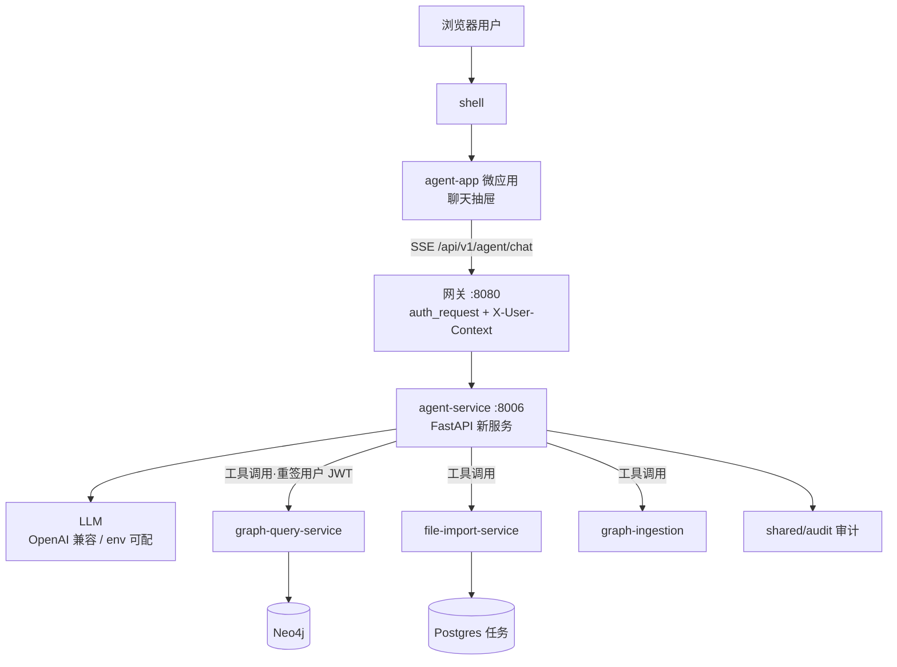

# 对话 Agent 方案（NL → 抽取 / 查询能力编排）

> 版本：v0.2（决策已定稿）
> 日期：2026-08-15
> 目标：在**抽取数据**（file-import-service + graph-ingestion）与**查询数据**（graph-query-service）之上增加对话式 AI Agent，
> 用户用自然语言完成"查图、拓图、分析、导入配置、任务追踪、亲密度重算"，所有能力仍走既有 ABAC / 脱敏 / 审计链路。

---

## 1. 背景与定位

现状（已核实）：

- **查询域**（graph-query-service :8001）：`init / search / expand / analyze` + 流式 `init/stream / expand/stream`（NDJSON chunked），L2 动作级校验（pep.py）、L3 可见性、L4 脱敏（masking.py）。
- **抽取域**（file-import-service :8005 + graph-ingestion :8003）：`import/files`（一文件一任务，串行队列，子任务流水线 parse → compute_intimacy）、`import/preview|templates|options|tasks`、`ingest/recompute-intimacy`；任务落 Postgres。
- **共享横切**：网关 nginx :8080 统一路由 + `auth_request` JWT 校验 + 注入 `X-User-Context`；ABAC 策略 `policies/kg.rego`；shared/pep-client、shared/audit、shared/api-client（OpenAPI 生成 TS SDK）。
- **前端**：Single-SPA 微前端（shell / graph-app / import-app / user-app），共享依赖 importmap；已有深链先例（import-app 查看 → `/graph?ids=...`）。
- **现状空白**：仓库内无任何 LLM / agent 代码，属全新能力。

定位：Agent 是**对话优先入口**（编排层），不是新业务模块，不复制查询/导入逻辑，只聚合既有服务能力；不使用特权身份，始终以**当前登录用户**的身份与权限执行。

## 2. 总体架构



关键点：

- **新服务 `services/agent-service`**（端口 8006）：独立服务聚合多域，理由：LLM 依赖/密钥/速率独立；放任一业务服务都会造成跨域耦合（"数据不共享 DB、模块间只走 API"原则）。`business-core-service` 是空壳预留（案件域），不占用。
- **传输用 SSE**（Server-Sent Events）：与现有"NDJSON chunked 流式"风格一致（网关已有 `proxy_buffering off` 先例），天然支持 token 增量、工具事件、结构化载荷；fetch 可 abort。
- **身份透传（核心安全设计）**：网关注入 `X-User-Context` 给 agent-service；agent-service 调用目标服务时，用共享 `AUTH_SECRET` **重签用户本人 JWT**（subject 属性不变）随 Bearer 发出 → 目标服务按既有 L2/L3/L4 全量执行（与用户手动调用完全一致），agent 自身不做二次过滤（避免不一致）。不引入任何服务账号/管理员身份。

## 3. 能力矩阵（工具注册表）

每个工具 = 现有端点的薄封装 + 参数 JSON Schema + 权限要求（L2 action）+ 输出摘要化（大结果截断/聚合，防上下文膨胀）。

| 域 | 工具 | 后端映射 | 读/写 | 备注 |
| --- | --- | --- | --- | --- |
| 查询 | `search_nodes` | `/graph/search` | 只读 | 模糊搜索，limit 上限 |
| 查询 | `init_graph` | `/graph/init` | 只读 | 按 ids 加载，结果摘要 + 可回传画布 |
| 查询 | `expand_graph` | `/graph/expand` | 只读 | conditions 走既有白名单校验 |
| 查询 | `analyze_node` | `/graph/analyze` | 只读 | call_circle 分析 |
| 查询 | `expand_stream`（P3） | `/graph/expand/stream` | 只读 | `graph` 事件直接上画布 |
| 抽取 | `list_import_templates` | `/import/templates` | 只读 | |
| 抽取 | `get_import_options` | `/import/options` | 只读 | 密级上限/可见性允许集 |
| 抽取 | `list_import_tasks` | `/import/tasks` | 只读 | 摘要，可见性=组织管辖（服务端已做） |
| 抽取 | `get_import_task` | `/import/tasks/{id}` | 只读 | 状态/步骤/错误解释（LLM 可解读失败原因） |
| 抽取 | `create_import_task`（P2） | `/import/files` | **写** | **确认流**；文件经前端上传后提交 |
| 抽取 | `recompute_intimacy`（P2） | `/ingest/recompute-intimacy` | **写** | **确认流** |
| 规则 | rule 查询（P3） | `/rules/*` | 只读 | graph-rule-service |

工具循环约束：单轮最多 8 次工具调用、输出每条截断（如节点摘要 ≤ 50 条）、失败自动回退 LLM 纠错。

## 4. 契约草案（SSE 事件协议）

`POST /api/v1/agent/chat`，请求：`{ session_id?, message, context?: { graph_ids?: string[] } }`（session_id 由前端本地生成，P1 透传可空、P3 持久化后服务端返回；context 携带当前画布选中节点，供"针对当前视图提问"）。

响应为 SSE 事件流：

| event | data | 说明 |
| --- | --- | --- |
| `delta` | `{"text": "..."}` | LLM 增量 token |
| `tool` | `{"name": "...", "status": "start|done|error", "summary": "..."}` | 工具调用过程卡片 |
| `graph` | `{"kind": "init|expand", "payload": {...}}` | 结构化图谱载荷（前端上画布/卡片） |
| `confirm` | `{"confirm_id": "...", "tool": "...", "args": {...}, "question": "..."}` | 写操作待确认（P2） |
| `done` | `{"session_id": "...", "messages": [...]}` | 结束；`messages` 为完整对话历史（P3 持久化用，前端忽略） |
| `error` | `{"message": "..."}` | 失败（LLM 不可用/超时/权限拒绝） |

辅助端点：`GET /api/v1/agent/tools`（调试）、`POST /api/v1/agent/confirm`（确认流，P2）、`POST /api/v1/agent/reset`。

网关新增：`upstream agent_service { server agent-service:8006; }` + `location /api/v1/agent/`（auth_request + `proxy_buffering off` + `proxy_read_timeout 300s`，照抄 stream location）。

## 5. 前端（新微应用 apps/agent-app）

- 形态：Single-SPA 子应用；**shell 挂聊天入口按钮 + 抽屉**（跨模块可用，推荐）或 graph-app 内面板（备选，见决策点 B）。
- SSE 客户端：仿 graph-app `streamRequest`（fetch + ReadableStream 按 \n 分帧），按事件类型分发。
- 渲染：消息气泡（回复文本 + 工具卡片 + 图谱结果卡片）；图谱结果卡片"在画布中打开" → `history.pushState('/graph?ids=...')`（复用 import-app openGraph 深链先例）。
- 写操作确认：`confirm` 事件 → 前端按钮（批准/拒绝）→ `/agent/confirm`。
- i18n / api client：照搬现有 zh-CN/en-US 模式；工具类型由 OpenAPI 生成后进 shared/api-client（`generate-api-client.sh` 纳入 agent-service）。

## 6. 实施阶段

### Phase 0 — 契约与脚手架（0.5~1 天）
- 新建 `services/agent-service`：pyproject（FastAPI + httpx + openai SDK）、Dockerfile、config.py（`LLM_BASE_URL / LLM_API_KEY / LLM_MODEL / AUTH_SECRET / MAX_TOOL_TURNS / MAX_OUTPUT_TOKENS`）、tests/ 骨架（仿 graph-query-service）。
- `infra/gateway/nginx.conf` + `infra/docker-compose*.yml` 加入 agent-service。
- `docs/agent-plan.md`（本文档）评审定稿。

### Phase 1 — 查询域对话 MVP（2~3 天）
- `app/llm.py`：LLMClient（OpenAI 兼容 chat-completions + function calling；超时/重试；走 .env 代理）。
- `app/tools/registry.py` + `app/tools/graph.py`：search/init/expand/analyze 四工具（httpx 调 graph-query，Bearer 重签 JWT，响应摘要化）。
- `app/agent.py`：工具循环（turn 上限、错误回退、输出裁剪）。
- `app/chat.py`：SSE 端点 + 事件协议；L2 依赖目标服务既有校验（不重复实现）。
- `apps/agent-app`：脚手架 + 聊天 UI + SSE 客户端 + 深链。
- 测试：mock LLM 的 `test_chat_sse.py`、`test_tools.py`、越权用例（低权限用户查高密数据 → 与手动一致）。

### Phase 2 — 抽取域 + 确认流（2 天）
- `app/tools/import_tools.py`（templates/options/tasks/task 详情）+ `app/tools/ingest.py`（recompute_intimacy）。
- 确认流：pending confirm 暂存（内存 + TTL），`/agent/confirm` 批准后执行；前端确认按钮。
- 文件获取（决策点 D）：MVP 建议"agent 引导用户在 import-app 上传，对话只做配置/追踪/解释"；对话内直传文件留 P3。
- 审计：工具调用写入 shared/audit（含 conversation_id）。

### Phase 3 — 增强（3~5 天）
- **结构化意图模板**（不做自由 NL→Cypher）：路径查询/共同邻居/邻域统计 → graph-query 新增只读模板端点（白名单参数），与"值级白名单校验"架构一致。
- `expand_stream` 工具：`graph` 事件流式上画布。
- 会话持久化（Postgres：agent_conversations / agent_messages）+ 历史摘要压缩 + 上下文注入（当前图 ids）。
- 规则域工具（graph-rule-service）；成本/限流/指标（照抄 observability 模式）。

## 7. 风险与对策

| 风险 | 对策 |
| --- | --- |
| 权限逃逸（agent 成为特权入口） | 恒为用户身份 + 目标服务既有 PEP；无服务账号；写操作确认流；越权测试 |
| 自由文本→Cypher 数据面风险 | **不做**；意图模板 + 白名单 + 只读（P3） |
| LLM 幻觉工具参数 | 参数 JSON Schema + 值级校验；工具失败回退 LLM 纠错 |
| Prompt 注入 | 对话内容永不进入查询结构/Cypher，仅作 search 关键词（模糊匹配） |
| LLM 网络不可用 | env 代理 + 超时重试；降级明确报错，不影响既有功能 |
| 成本/上下文失控 | max_turns / max_tokens / 输出截断 / 摘要压缩 / 单用户并发限制 |
| 流式被网关缓冲 | `proxy_buffering off`（stream 先例照抄） |

## 8. 验收标准

1. "找出和张三有转账关系的人" → 画布展开结果与手动 expand **逐条一致（含脱敏）**。
2. 低密级用户询问高密级数据 → 不泄露（与手动查询一致，自动化测试）。
3. "最近导入的任务怎么样了" → 任务摘要 + 失败原因解读。
4. "帮我把 sample.csv 按通话模板导入" → 确认流出现，批准后才创建任务并追踪状态。
5. 契约：OpenAPI 生成 SDK 通过 `check-api-contract.sh`。

## 9. 决策定稿（2026-08-15 用户确认）

| 决策点 | 结论 |
| --- | --- |
| A. LLM 来源 | **先只写配置，不接真实 LLM**：`LLM_PROVIDER` env 驱动（`mock` 默认 / `openai` 预留），真实 provider 后续启用；mock 用于跑通全链路与测试 |
| B. 前端入口 | **shell 全局聊天抽屉**（跨模块唤起） |
| C. MVP 范围 | **只读查询对话（Phase 1）**，写操作（导入执行/亲密度重算）确认流留 Phase 2 |
| D. 文件获取 | **引导到 import-app 上传**，对话只做配置/追踪/解释 |

## 10. 下一步实施清单（按定稿范围 = Phase 0 + Phase 1）

1. **P0 脚手架**：`services/agent-service`（pyproject / Dockerfile / config.py / tests 骨架），网关 nginx + docker-compose 接入 :8006。
2. **P0 配置层**：`app/llm.py` 定义 `LLMClient` 接口 + `LLMProvider` 工厂（env: `LLM_PROVIDER=mock|openai`、`LLM_BASE_URL/LLM_API_KEY/LLM_MODEL` 预留）；`MockLLM` 按脚本/规则产出工具调用序列与回复，保证无真实模型时端到端可跑、可测。
3. **P1 查询工具**：`app/tools/registry.py` + `app/tools/graph.py`（search / init / expand / analyze），httpx 调 graph-query，Bearer 重签用户 JWT（AUTH_SECRET），响应摘要化。
4. **P1 Agent 循环**：`app/agent.py` 工具循环（turn 上限 8、失败回退、输出裁剪）+ `app/chat.py` SSE 端点与事件协议（delta/tool/graph/done/error）。
5. **P1 前端**：`apps/agent-app` 微应用 + shell 抽屉挂载；SSE 客户端（仿 streamRequest）；消息气泡 + 工具卡片 + 图谱结果卡片深链 `/graph?ids=...`。
6. **P1 测试**：mock LLM 的 SSE 端到端测试、工具层测试、越权一致性测试（低权限用户查高密数据 → 与手动一致）。

## 11. 实现约定（P1 定稿：run_agent 参数契约 / get_env / 内置常量）

### 11.1 run_agent 参数契约（5 参，够用）

```python
async def run_agent(
    *,
    message: str,
    context: ChatContext | None,
    session_id: str | None,
    llm: LLMClient,
    tools: ToolRegistry,
) -> AsyncIterator[SseEvent]:
```

| 参数 | 来源 | 说明 |
| --- | --- | --- |
| `message` | 请求体 `ChatRequest.message` | 用户本轮消息 |
| `context` | 请求体 `ChatRequest.context` | `graph_ids` + **服务端注入 `subject`**（chat.py 从 X-User-Context/JWT 解析后覆写，客户端传值无效，防伪造） |
| `session_id` | 请求体 `ChatRequest.session_id` | P1 透传可空；P3 会话持久化后由存储生成/校验 |
| `llm` | 装配期 `get_llm()` | `LLM_PROVIDER` env 决定 mock/openai |
| `tools` | 注册表单例 `registry` | `specs()` 给 LLM 元数据；`execute()` 执行 + 异常兜底（含未知工具） |

不设参数的理由：`system_prompt` / 轮数上限 / 输出裁剪 / delta 分块 → **内置常量（agent.py，§11.3）**；
`history` → P3 由 `session_id` 在 run_agent 内加载（届时按需加参）；`execute_tool` → 被 tools 注册表吸收（§11.4）。

### 11.2 环境变量统一入口（config.get_env）

- `app/config.py` 提供 `get_env / get_env_int / get_env_float / get_env_bool / get_env_list`，**各文件直接 import 使用**，不建 Settings 单例、不注入参数。
- 内置默认值随调用处写死（如 `get_env_int("MAX_TOOL_TURNS", 8)`）。

### 11.3 内置常量（agent.py）

- `SYSTEM_PROMPT`：角色 + 安全约束（只依据工具事实、不编造、结果为空明说、中文）。
- `MAX_TOOL_TURNS`（env `MAX_TOOL_TURNS`，默认 8）、`MAX_OUTPUT_TOKENS`（默认 2048）、`DELTA_CHUNK`（64 字符分块）。

### 11.4 工具注册表形态

- `ToolRegistry.register(spec, handler)`：`spec` 是给 LLM 的元数据（JSON Schema），`handler` 是 `async (call, subject) -> ToolResult`（P1 用 httpx 调 graph-query + JWT 重签，P2 扩展 import/ingest 域）。
- `registry.specs()` 只出元数据（不含 handler）；`registry.execute(call, subject)` 负责查找、执行、异常 → `ToolResult(ok=False)` 兜底（回填 LLM 自我纠错）。
