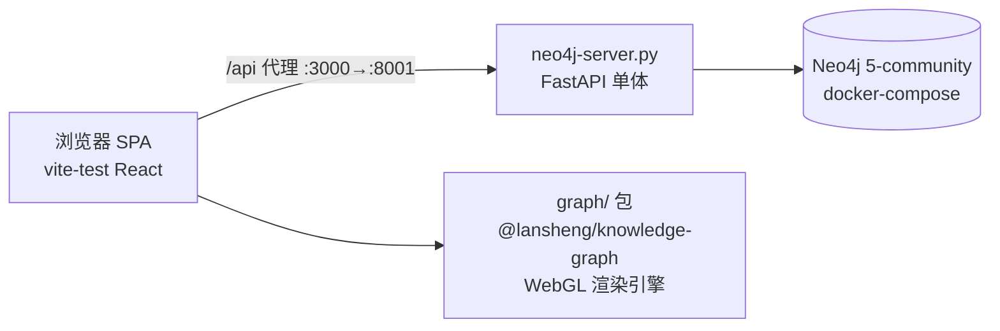
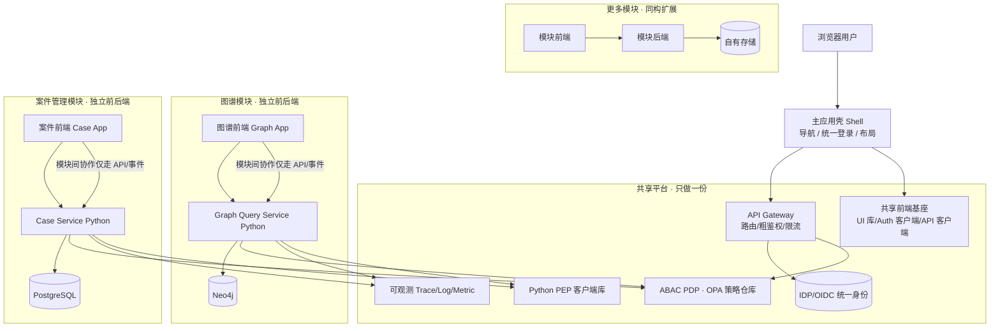
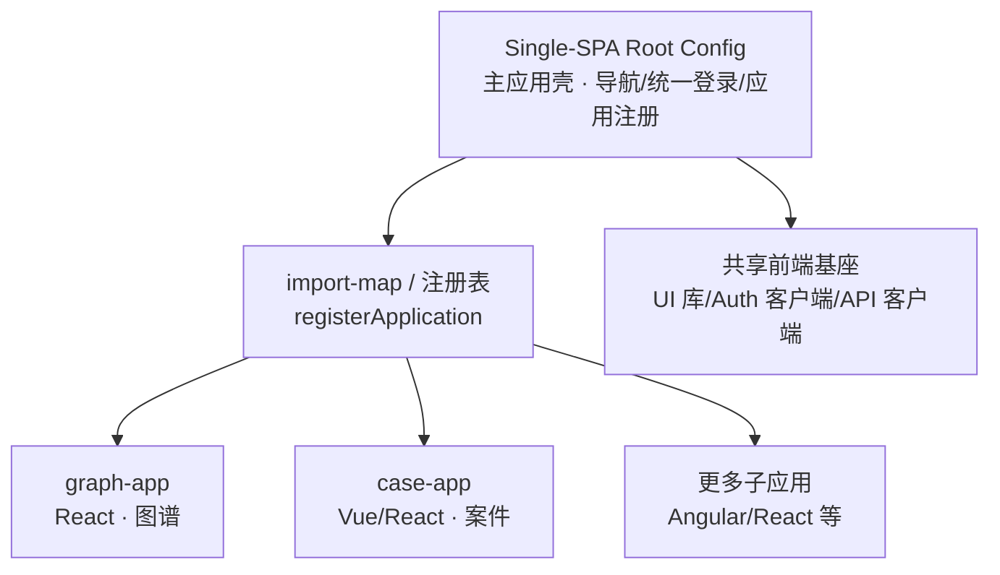
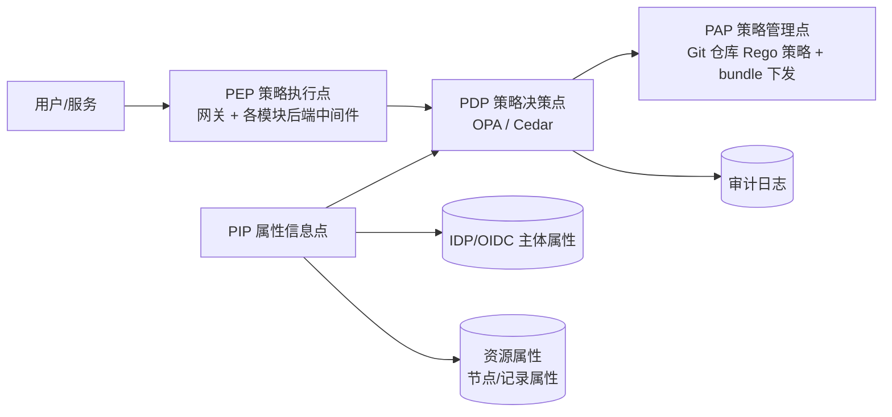
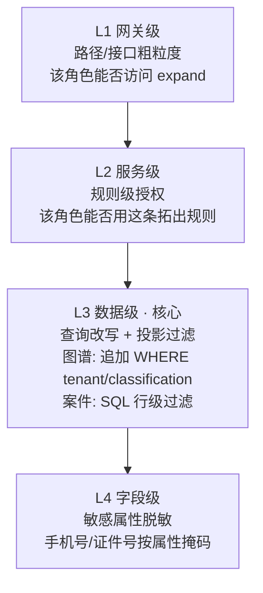
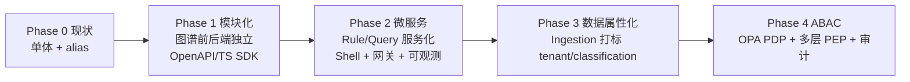

# 知识图谱平台架构设计方案

> 版本：v0.1（草案）
> 日期：2026-07-31
> 范围：以 `vite-test` 为当前载体，覆盖图谱模块（含后端）、微服务化演进、ABAC 权限体系、前端多模块/多技术栈集成。

---

## 1. 背景与目标

### 1.1 背景

当前项目是一个**知识图谱可视化 + 查询**系统：

- 前端：`vite-test`（React + Vite + TypeScript），基于 WebGL 渲染引擎 `graph/`（`@lansheng/knowledge-graph`）。
- 后端：`neo4j-server.py`（FastAPI 单体），提供 `init / search / expand` 三个查询接口，直接连接 Neo4j。
- 数据：Neo4j 5-community（docker-compose），节点类型含 person / phone / address / account / company / ip / device，离线脚本 `generate-data.py` 生成数据。

### 1.2 目标

1. 把图谱（含后端）作为一个**可独立演进、可复用的模块**；
2. 平滑演化为**微服务架构**，每个业务模块（图谱、案件管理等）拥有**独立前端 + 独立后端 + 独立数据**；
3. 防止"一个模块改动导致另一个模块出 bug"，提升模块稳定性与团队并行能力；
4. 在整体架构内引入 **ABAC（属性访问控制）**，支持多租户、密级、字段级脱敏等细粒度权限；
5. 前端支持**多模块集成**，并具备**跨技术栈**（React/Vue/Angular 等）接入能力。

### 1.3 设计原则

| 原则                   | 说明                                                                     |
| ---------------------- | ------------------------------------------------------------------------ |
| **模块自包含**         | 每个业务模块拥有自己的前端、后端、数据存储，模块间只走 API/事件          |
| **契约优先**           | 模块间通过稳定契约（HTTP API / 事件 / 挂载生命周期）协作，不共享内部实现 |
| **共享横切能力**       | 鉴权、ABAC 决策、可观测、前端基础库"只做一份"，各模块复用                |
| **数据不共享 DB**      | 模块间通过 ID 引用 + API + 事件协作，禁止直连对方数据库                  |
| **决策集中、执行分散** | ABAC 策略集中管理，在各模块后端分层执行                                  |
| **不发布包**           | 所有模块与共享代码在本地 monorepo 内引用，不做 npm 发布                  |
| **渐进演进**           | 采用 Strangler Fig 模式，从现状逐步迁移，避免重写                        |

---

## 2. 现状分析

### 2.1 当前结构



### 2.2 当前耦合点

| 耦合点           | 位置                                                                                   | 说明                              |
| ---------------- | -------------------------------------------------------------------------------------- | --------------------------------- |
| 渲染引擎源码引用 | `vite-test/vite.config.ts` 用 path alias 指向 `graph/src`                              | 应用与库强耦合                    |
| API 硬编码       | `vite-test/src/hooks/useGraphApp.ts`、`expansion-service.ts` 直接 `fetch /api/graph/*` | 前端写死后端地址与路径            |
| 规则前端化       | `RuleMenu.tsx` 由前端组装 conditions JSON 下发给后端                                   | 规则逻辑在前端，后端被动拼 Cypher |
| 数据写入离线     | `scripts/generate-data.py` 离线导入                                                    | 无在线写入/打标通道               |
| 无安全           | 后端无鉴权、CORS 全开、无多租户                                                        | ABAC 无从谈起                     |

---

## 3. 总体架构

### 3.1 分层总览



### 3.2 第一步：图谱模块化

目标：把"图谱"从单体内拆成一个边界清晰、可独立演进的模块（前端 + 后端 + 数据）。

#### 3.2.1 前端拆分

| 模块                    | 内容                                       | 产出方式                                                                                  |
| ----------------------- | ------------------------------------------ | ----------------------------------------------------------------------------------------- |
| `graph/` 渲染引擎       | 纯 TS WebGL 渲染库，**不含任何网络请求**   | 保持源码引用（不发布），通过 monorepo workspace / alias 引入                              |
| Graph App（图谱子应用） | 画布 + 面板 + 搜索 + 拓出 + 快照 + 分析 UI | 独立 Vite 应用（Single-SPA 子应用），通过 **props 注入 fetcher 与 auth**，不内置 API 地址 |

关键设计：**渲染引擎层不碰网络**（已满足），**应用层通过注入的 `ExpansionFetcher` 访问后端**（`expansion-service.ts` 已是注入模式，延续即可）。

#### 3.2.2 后端拆分

把 `neo4j-server.py` 独立为 `graph-query-service`：

- API 契约版本化：`/api/v1/graph/init|search|expand`；
- 请求/响应模型用 Pydantic 固化为 `GraphNode / GraphLink / NeighborSummary / PageResult`；
- 由 OpenAPI 生成前端 TS client SDK（openapi-typescript），消除前后端手工对齐；
- 配置外置（env）、连接池、重试、超时显式化；
- 独立 Dockerfile + 版本号。

#### 3.2.3 模块契约

- 前后端契约：`/api/v1/graph/*`（OpenAPI 定义）。
- 规则契约：前端自由传 conditions JSON（保留工作流式组合），后端做**值级白名单校验**，ABAC 做最终裁决（见 3.3.2 Rule Service）。

### 3.3 第二步：微服务架构（每模块独立前后端）

采用 **Self-Contained Systems（自包含系统）/ 纵向切分微服务 + 微前端（Single-SPA）** 模式。

#### 3.3.1 服务划分

| 服务                           | 职责                                              | 数据             | 现状对应                            |
| ------------------------------ | ------------------------------------------------- | ---------------- | ----------------------------------- |
| **Graph Query Service**        | init / search / expand 只读查询；ABAC 查询改写    | Neo4j            | `neo4j-server.py`（迁移主体）       |
| **Graph Rule Service**         | 规则定义、**参数白名单/校验**、版本、授权属性管理 | PostgreSQL       | `RuleMenu` 的 conditions 收敛于此   |
| **Graph Ingestion Service**    | 在线写入、批量导入、安全属性打标                  | Neo4j            | `generate-data.py` 服务化           |
| **Graph Analysis Service**     | 社区发现、中心性、权重（异步）                    | Neo4j + 消息总线 | `AnalysisPanel` 后端化              |
| **Snapshot & History Service** | 快照存取、历史回溯                                | 对象存储         | `SnapshotPanel` + `history-manager` |
| **Case Service**（示例新模块） | 案件管理业务                                      | PostgreSQL       | 新增                                |

#### 3.3.2 规则服务化（关键收敛点）

**前端自由传条件 JSON（保留工作流式节点拓展的灵活性），真正的安全边界在后端**——采用"后端值级白名单校验 + ABAC 最终裁决"：

1. **前端自由组装**：`RuleMenu` 允许用户自由组合条件、多步串联、传参，形成工作流式节点拓展；前端只做 UX 层的权限提示/字段限制，**不构成安全边界**。
2. **后端校验器（值级白名单）**：`graph-query-service` 收到 conditions JSON 后，先过一层**规则模式校验**：
   - 字段白名单：只接受预定义的规则字段与操作符（`nodeType`、`direction`、`hops`、属性名、`== / in / > / <` 等）；
   - 值白名单：属性取值只允许预定义枚举/类型/范围；
   - 未知字段、未授权操作符、越界值 → **忽略或 400 拒绝**，即使传过来也不生效；
   - Cypher 仍由后端**受控规则模板**生成，前端 JSON 只是"参数化请求"，永远无法注入任意查询逻辑。
3. **ABAC 最终裁决**：校验通过后走 L2 规则级授权 + L3 数据级查询改写（无条件追加 tenant/classification），再补 L4 字段脱敏。白名单之外的值在更上层已被拦下，**"传了也没用"**。

**收益**：工作流式节点拓展能力完全保留；安全不依赖前端——未知值一律不生效；规则可版本化、可授权、可审计不变；后端只按白名单组合生成 Cypher，不再被动拼任意查询。

#### 3.3.3 共享横切设施

- **API Gateway**：统一入口、TLS、限流、路由（`/api/v1/graph/*` → Query，`/api/v1/rules/*` → Rule），网关级粗粒度 ABAC。
- **IDP/OIDC**：统一登录，签发 JWT（含 `roles / department / clearance / tenantId` 等主体属性）。
- **OPA 策略仓库**：ABAC 策略集中维护、版本化、打包 bundle 下发。
- **可观测性**：OpenTelemetry 全链路 Trace，Prometheus 指标（QPS/P99/Neo4j 慢查询），Loki 日志，独立审计通道。
- **配置与密钥**：配置中心 + Vault 管理 Neo4j 等口令；每服务独立最小权限账号。
- **消息总线**：Kafka/RabbitMQ，用于写入事件、缓存失效、异步分析。

#### 3.3.4 前端多模块集成（Single-SPA 微前端）

前端"每模块独立应用"，由**主应用壳（Shell）**统一承载，微前端基座采用 **Single-SPA**。

**架构示意**：



**集成方式对比**：

| 方案                   | 隔离强度                          | 跨技术栈                | 代价                                    |
| ---------------------- | --------------------------------- | ----------------------- | --------------------------------------- |
| **iframe 嵌入**        | 最强（独立 build/运行时）         | ✅ 完全                 | 双份加载、通信稍复杂、UX 略差           |
| **Single-SPA（选型）** | 强（生命周期契约 + 可按需加沙箱） | ✅ React/Vue/Angular 等 | 引入微前端框架，沙箱/样式隔离需自行搭建 |
| **Module Federation**  | 中（共享依赖）                    | ⚠️ 跨栈易出问题         | 运行时共享削弱隔离，构建耦合            |

**选型建议**：**默认采用 Single-SPA 作为微前端基座**——主应用壳（Root Config）注册各子应用，遵循 `bootstrap / mount / unmount` 生命周期，通过 import-map 按路由懒加载；样式/JS 隔离按需补充（沙箱、CSS 前缀约定）。不使用 Module Federation。

> **说明**：不引入封装框架，保持**原生 Single-SPA** 的轻量与可控；JS/样式隔离由共享前端基座自行约定实现（沙箱、CSS 前缀/命名空间）。

#### 3.3.5 前端跨技术栈能力

前端跨技术栈（图谱 React、案件 Vue、统计 Angular）可行，前提是遵循**前端跨栈契约**：

1. **挂载边界**：壳层往 DOM 容器挂载应用，约定生命周期 `bootstrap / mount / unmount`（与 Single-SPA 应用契约天然一致）；
2. **路由约定**：壳层占主路由，各模块挂在自己路径段下（`/graph/*`、`/case/*`）；
3. **鉴权注入**：token 只由壳层换取，通过 props/postMessage 注入各模块；
4. **主题统一**：CSS 变量传递品牌主题，跨栈可读；
5. **通信**：统一事件总线（自定义事件 / postMessage），模块间不 import 对方代码；
6. **UI 一致性**：跨栈时视觉靠 CSS 变量 + 规范约束，或用 Web Component 做跨栈共享组件。

> **务实建议**：默认统一主技术栈（如全 React）以降低成本；仅在"老系统集成 / 独立团队主导 / 采购现成前端"等强理由下，将第二技术栈作为独立黑盒模块用 Single-SPA 注册（或 iframe）接入。

#### 3.3.6 仓库结构（monorepo，不发布包）

```
repo/
  apps/
    shell/                # 主应用壳（Single-SPA root-config，注册/路由子应用）
    graph-app/            # 图谱子应用（React，Single-SPA 应用）
    case-app/             # 案件子应用（示例，可异栈）
  services/
    graph-query-service/  # 图谱查询 Python
    graph-rule-service/   # 规则定义 + 参数白名单校验 Python
    graph-ingestion/      # 写入/打标 Python
    case-service/         # 案件 Python（示例）
  shared/
    ui-kit/               # 前端基础库（本地引用）
    api-client/           # 前端 API 客户端（由 OpenAPI 生成）
    pep-client/           # Python ABAC PEP 客户端（本地引用）
  policies/               # OPA Rego 策略 + 测试
  infra/
    gateway/              # 网关配置
    docker-compose.yml    # 本地一键起全部
```

#### 3.3.7 部署

- **开发**：docker-compose 一键起（Shell/Single-SPA + 网关 + IDP + OPA + 各服务 + 各存储）。
- **生产**：Kubernetes，每服务一镜像一 Deployment；Shell 与各子应用独立部署，import-map 集中管理子应用版本；可选 service mesh（Istio）将 ABAC PEP 做成 sidecar。

---

### 3.4 第三步：ABAC 权限体系

**核心原则：决策集中（PDP 只有一份），执行分散（各模块后端各有一个 PEP）。**

#### 3.4.1 ABAC 组件（XACML 模型）



#### 3.4.2 属性来源

- **主体属性**：网关校验 JWT（OIDC），解析 `roles / department / clearance_level / tenantId / risk_score` 注入请求上下文，各服务不再各自解析。
- **资源属性**：**数据入库时强制打标**——图谱节点/边打 `tenantId / classification / owner / visibility`，案件记录打 `case_level / owner_team / tenantId`。
- **动作属性**：`init / search / expand` 等即 action，路由即 action。
- **环境属性**：时间、来源 IP、风险分等。

#### 3.4.3 分层执行（纵深防御）



- **L1 网关 PEP**：HTTP 方法 + 路径级粗判。
- **L2 服务 PEP**：Rule Service 判断主体能否使用某规则；Query Service 判断能否 init/search。
- **L3 数据级 PEP（核心难点）**：Neo4j Community 无行级安全，采用：
  - **查询改写**：把策略注入 Cypher，如追加 `AND n.tenantId = $tenant AND n.classification <= $clearance`；
  - **投影过滤**：返回后在服务内存中按策略裁剪不可见节点/边，防止侧信道推断；
  - 多租户采用 `tenantId` 属性 + 强制改写（运维成本低于 per-database）。
- **L4 字段级**：敏感字段按主体属性掩码返回（如 `138****1234`）。

#### 3.4.4 ABAC 与 RBAC 组合

- RBAC 管"角色能进哪些功能"（粗），ABAC 管"该数据/节点是否可见"（细）。
- 策略示例（Rego 伪码）：

```rego
allow if
  subject.tenantId == resource.tenantId              # 租户隔离
  and subject.clearance >= resource.classification   # 密级
  and action in ["init", "search", "expand"]         # 动作
  and resource.nodeType not in denied_types_for_role[subject.roles]
  and time.within_work_hours                         # 环境
```

#### 3.4.5 前端角色

- 前端**不做权限决策**，只渲染后端返回的数据；
- 壳层仅根据网关返回的粗粒度权限菜单决定"显示哪些模块入口"；
- 跨模块 ABAC 由各后端 PEP 统一执行。

#### 3.4.6 审计与合规

- 每个 PEP 决策输出 `subject / resource / action / decision / reason` 到独立审计通道（不可篡改、保留期限策略）；
- 越权尝试告警；
- 明确"允许但返回空" vs "拒绝"的语义，防止通过图谱存在性推断侧信道。

---

## 4. 演进路线图



- **Phase 1**：图谱后端独立成服务 + 契约 SDK + 前端应用独立成模块。工作量小、收益大、风险低。
- **Phase 2**：先拆 Rule Service（规则定义 + 值级白名单校验收敛服务端），再上 Shell / 网关 / 可观测。
- **Phase 3**：数据打标是 ABAC 的地基，**必须先于** Phase 4。
- **Phase 4**：先 L1 网关 + L3 租户改写（高价值），再补密级过滤与字段脱敏。

---

## 5. 风险与权衡

| 风险/成本                               | 缓解措施                                                  |
| --------------------------------------- | --------------------------------------------------------- |
| 多模块重复基础设施（登录/ABAC/监控/CI） | 共享平台只做一份 + 模块脚手架（cookiecutter）保证姿势一致 |
| 前端多应用 UX 割裂                      | Single-SPA 统一 Shell 导航、统一登录态、CSS 变量统一视觉  |
| 跨技术栈维护成本高                      | 默认同栈，异栈按需引入且作为黑盒模块                      |
| 模块间数据关系（图谱↔案件）             | 只走 API + 外键引用 + 事件，禁止直连对方 DB               |
| ABAC 策略漂移                           | 策略集中一个仓库 + bundle 下发 + PEP 客户端共享一份       |
| Neo4j 无行级安全                        | 查询改写 + 投影过滤（L3 数据级 PEP）                      |

---

## 6. 待确认问题（TODO）

- [ ] Single-SPA 落地细节：沙箱/样式隔离方案（由共享前端基座自行实现）、import-map 部署方式（静态 / 动态下发）。
- [ ] 统一主技术栈是否确定（建议 React）。
- [ ] 多租户 vs 单租户 + 多部门：影响 ABAC 资源属性设计。
- [ ] 规则条件 JSON 的白名单规范（允许字段/操作符/取值）与后端校验实现。
- [ ] Neo4j 部署形态：单实例 / 集群 / 每个租户独立库。
