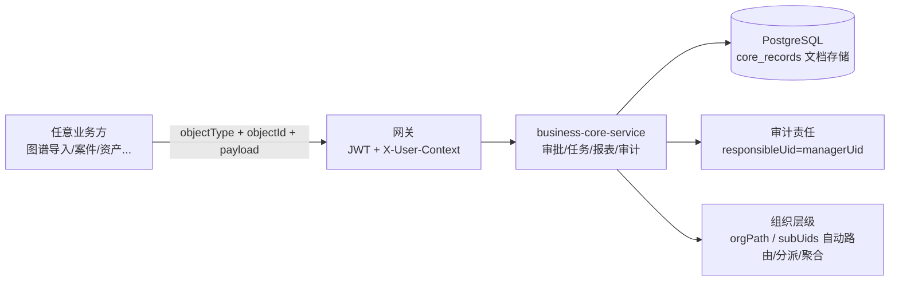

# 通用业务能力组件（business-core-service）方案

> 版本：v0.1
> 日期：2026-08-05
> 范围：审批流 / 任务分派 / 报表聚合 / 审计责任——**业务无关**的通用能力模块，可对接任意业务（图谱导入、案件、资产等）。
> 状态：已实现 + 19 测试通过 + dev 冒烟跑通（详见 §7）。

---

## 1. 定位与设计原则

**通用业务能力组件**：不感知任何具体业务，只提供**数据存储 + 状态/审批/分派/聚合/审计逻辑**。
业务方通过通用契约接入；业务对象由业务方自己维护，模块只存引用与业务上下文。

### 设计原则

- **业务无关**：模块不认识"图谱导入 / 案件 / 资产"，只认 `objectType + objectId + payload(JSON)`
- **只提供存储与逻辑**：不预设业务表结构（通用文档存储），只做状态机 / 审批 / 分派 / 聚合 / 审计
- **组织层级复用**：主体一律来自 `X-User-Context`（`uid/tenantId/orgPath/managerUid/subUids/teams`），审批路由、任务分派、报表组织维度、审计责任全按组织层级自动计算
- **权限/审计沿用平台**：PEP + OPA + 网关 JWT 校验

### 数据流



## 2. 通用契约

业务方对接时只传：

```jsonc
{ "objectType": "import_task", "objectId": "c68741ce8f74",
  "payload": { "entityCount": 4, "tags": {...} } }
```

模块不解释 payload 语义；主体身份（租户/组织/上下级）一律来自 `X-User-Context`。

## 3. 四个能力模块

### 3.1 审批流（Approval）

- **模型**：`approval`（type/objectType/objectId/payload/applicantUid/approverUid/status/records[]）
- **状态机**：`pending → in_review → approved | rejected`
- **自动路由**：`approvers` 为空 → 按申请人 `managerUid`（组织层级）找上级
- **动作**：`approve` / `reject` / `comment`（仅审批人可 approve/reject）
- **API**：`POST/GET /api/v1/approval/requests`、`GET .../requests/{id}`、`POST .../requests/{id}/action`

### 3.2 任务分派（Task）

- **模型**：`task`（objectType/objectId/payload/assigneeUid/assignByOrg/status/dueAt）
- **分派**：直接指派 `assigneeUid`；按组织分派 `assignByOrg` → 派给该组织下的下级成员
- **生命周期**：`todo → doing → done | cancelled`
- **可见性**：本人 / 下级（subUids）/ 创建者可见可改
- **API**：`POST/GET /api/v1/tasks`、`POST /api/v1/tasks/{id}/status`

### 3.3 报表聚合（Report）

- **模型**：`report_definition`（name/dataset/groupBy）+ `report_result`（rows）
- **聚合**：dataset ∈ {task, approval, audit}，groupBy ∈ {assigneeUid, orgPath, status, type, objectType, action}
- **组织维度**：只统计**本组织（orgPath 子树）**的数据
- **API**：`POST/GET /api/v1/reports/definitions`、`POST .../definitions/{id}/run`

### 3.4 审计责任（Audit）

- **模型**：`audit`（tenantId/actorUid/responsibleUid/action/objectType/objectId/payload/orgPath/at）
- **责任上级**：`responsibleUid = 操作者 managerUid`（组织层级）
- **追溯**：按租户 / 对象 / 动作 / 时段，仅本组织及下级组织
- **API**：`POST/GET /api/v1/audit/events`

## 4. 存储设计：通用文档存储

"只提供数据存储"定位 → 用文档模型最贴合，**不预设业务表结构**：

```
core_records(kind TEXT, id TEXT, doc JSONB, PRIMARY KEY(kind, id))
```

- Memory（测试/演示）与 Postgres（生产）同接口
- 逻辑层以 `kind`（approval/task/report_definition/report_result/audit）存取文档

## 5. 与现有平台衔接

| 点 | 说明 |
| --- | --- |
| 主体上下文 | `X-User-Context`（网关注入）含 `uid/tenantId/orgPath/managerUid/subUids/teams`；auth 已加 `managerUid` |
| 网关 | `/api/v1/{approval|tasks|reports|audit}/*` → business-core（带 JWT 校验 + 主体注入） |
| 权限 | 沿平台 PEP/OPA 约定；组织范围判定在模块内（`scope.org_in_scope` / `uid_in_scope`） |
| 审计 | 通用审计事件 + 责任上级；后续可并入共享 audit 通道 |

## 6. 服务与端口

- `services/business-core-service/`（FastAPI，PostgreSQL）
- dev/prod compose 加 `business-core`（dev: kg-dev-business-core:8006）
- 端口：8006（8001-8005 已占用）

## 7. 落地状态（2026-08-05）

- [x] 服务骨架 + 通用文档存储（memory/postgres）
- [x] 审批流（状态机 + 自动路由）、任务分派、报表聚合、审计责任
- [x] auth 主体上下文加 `managerUid`
- [x] dev/prod compose + 网关路由
- [x] 19 个单元测试通过
- [x] dev 冒烟：自动路由→审批通过→审计责任(u-admin)→报表聚合(approved=1)

## 8. 后续待办

- [ ] 前端"通用能力管理页"（shell 子应用：审批待办、任务列表、报表、审计查询）
- [ ] 审计事件并入共享 audit 通道（shared/audit）
- [ ] 审批多级 / 会签（多人审批）
- [ ] 报表支持参数与定时执行（report_jobs）
