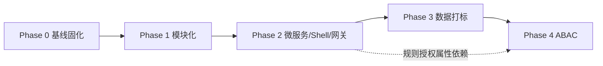

# 知识图谱平台重构计划（可执行版）

> 关联文档：[architecture.md](./architecture.md)（目标架构）· 本文是执行计划
> 版本：v0.1 ｜ 日期：2026-08-01 ｜ 状态：草案
> 策略：**Strangler Fig 渐进演进**，每阶段可独立上线、可回滚、不阻塞业务

---

## 0. 总览

### 0.1 目标

1. 把"图谱"拆成**独立前后端模块**（`graph-app` + `graph-query-service`），可独立演进；
2. 演化出 **Single-SPA 微前端**（无 qiankun）+ **API 网关** + 可观测，支持多模块/多技术栈；
3. 规则**收敛服务端**（定义 + 值级白名单校验 + 版本 + 授权），前端仍可自由组合 conditions JSON；
4. 数据**强制打标**（tenant/classification），为 ABAC 铺地基；
5. 落地 **ABAC**：OPA(PDP) + 多层 PEP(L1–L4) + 审计。

### 0.2 非目标（本期不做）

- 不发布 npm/pip 包（全部本地 monorepo 引用）；
- 不上 qiankun / micro-app / Module Federation（选型 Single-SPA 原生）；
- 不引入第二技术栈前端（默认全 React）；
- 不做大规模 UI 重构，保持现有交互不变（行为优先，结构后置）。

### 0.3 里程碑总览

| 里程碑                       | 对应 Phase | 核心交付                                                  | 依赖           |
| ---------------------------- | ---------- | --------------------------------------------------------- | -------------- |
| **M0 基线固化**              | Phase 0    | 测试/CI/契约快照，重构安全网                              | —              |
| **M1 图谱模块化**            | Phase 1    | `graph-query-service` + OpenAPI/TS SDK + `graph-app` 独立 | M0             |
| **M2 微服务 + Shell + 网关** | Phase 2    | Rule Service + API Gateway + Single-SPA Shell + 可观测    | M1             |
| **M3 数据属性化**            | Phase 3    | Ingestion Service + 节点/边打标 + 存量迁移                | M2             |
| **M4 ABAC**                  | Phase 4    | IDP + OPA + `pep-client` + L1–L4 PEP + 审计               | M3（必须先于） |

### 0.4 依赖与顺序



> 铁律：**M3（数据打标）必须先于 M4（ABAC）**；M2 内部 Rule Service 先行（它是 L2 授权的载体）。

---

## 1. 现状基线

### 1.1 技术栈（现状）

| 层       | 技术                                                      | 位置                                     |
| -------- | --------------------------------------------------------- | ---------------------------------------- |
| 前端     | React + Vite + TS，WebGL 渲染 `@lansheng/knowledge-graph` | `vite-test/` + `graph/`（alias 引用）    |
| 后端     | FastAPI 单体，直接连 Neo4j                                | `vite-test/neo4j-server.py`（端口 8001） |
| 数据     | Neo4j 5-community                                         | `vite-test/docker-compose.yml`           |
| 数据生成 | 离线脚本                                                  | `scripts/generate-data.py`               |

### 1.2 关键耦合点 → 计划动作

| #   | 耦合点             | 现状文件                                                                                 | 计划动作（对应任务）                                                 |
| --- | ------------------ | ---------------------------------------------------------------------------------------- | -------------------------------------------------------------------- |
| C1  | 渲染引擎源码 alias | `vite-test/vite.config.ts`：`@lansheng/knowledge-graph → ../graph/src`                   | 保留 alias（不发布包），迁移后改为 monorepo workspace 引用（P1.2.3） |
| C2  | API 路径硬编码     | `vite-test/src/hooks/useGraphApp.ts`：`fetch("/api/graph/init")`；`expansion-service.ts` | 替换为 OpenAPI 生成的 TS SDK + 地址外置（P1.3）                      |
| C3  | 规则前端化         | `vite-test/src/RuleMenu.tsx` 组装 `{targetType, relationType, direction, filters[]}`     | 收敛为 Rule Service 的规则定义 + 白名单校验（P2.1）                  |
| C4  | 数据离线写入       | `scripts/generate-data.py`                                                               | 服务化为 Ingestion Service + 打标（P3.1）                            |
| C5  | 无安全             | `neo4j-server.py`：CORS `*`、无鉴权                                                      | 网关粗鉴权 + ABAC（P2.2 / Phase 4）                                  |

### 1.3 契约锚点（后端现有字段，供白名单设计）

- `init`: `{ ids: string[] }` → `graphData`
- `expand`: `{ sourceNodeId, ruleId, existingNodeIds[], existingLinkIds[], conditions?: string }`
- `conditions` 前端结构（RuleMenu）：`{ targetType, relationType, direction, filters: [{ property, operator, value }] }`

> 白名单校验字段即以此为准：`targetType / relationType / direction / filters[].property / filters[].operator / filters[].value`。

---

## 2. 目标形态（monorepo）

### 2.1 目标目录

```
knowledge-graph/
  apps/
    shell/                # Single-SPA root-config（注册/路由子应用）
    graph-app/            # 图谱前端（React，Single-SPA 子应用）
  services/
    graph-query-service/  # 图谱查询（FastAPI，/api/v1/graph/*）
    graph-rule-service/   # 规则 + 白名单校验（FastAPI，/api/v1/rules/*）
    graph-ingestion/      # 写入/打标（FastAPI）
    case-service/         # 示例新模块（可选，后置）
  shared/
    ui-kit/               # 前端基础库（本地引用）
    api-client/           # OpenAPI 生成 TS SDK（本地引用）
    pep-client/           # Python ABAC PEP 客户端（本地引用）
  graph/                  # WebGL 渲染引擎（保持现状）
  policies/               # OPA Rego 策略 + 测试
  infra/
    gateway/              # 网关配置（路由/限流）
    docker-compose.yml    # 本地一键起全栈
  scripts/                # 迁移/backfill 脚本
  docs/                   # architecture.md / refactoring-plan.md
```

### 2.2 服务/应用矩阵

| 应用/服务             | 技术              | 契约                                 | 数据       |
| --------------------- | ----------------- | ------------------------------------ | ---------- |
| `shell`               | Single-SPA (原生) | —                                    | —          |
| `graph-app`           | React + Vite      | `/api/v1/graph/*`（经 SDK）          | —          |
| `graph-query-service` | FastAPI           | `/api/v1/graph/init\|search\|expand` | Neo4j      |
| `graph-rule-service`  | FastAPI           | `/api/v1/rules/*`                    | PostgreSQL |
| `graph-ingestion`     | FastAPI           | `/api/v1/ingest/*`                   | Neo4j      |
| `gateway`             | Nginx/Envoy/Kong  | 路由 + 限流 + JWT 校验               | —          |

---

## 3. 分阶段执行计划

> 每个任务含：**ID / 描述 / 涉及文件 / 验收**。完成后在 [ ] 打勾。

### Phase 0 — 基线固化（M0）

> 目的：重构前建立安全网，保证后续每一步可回归。

- [x] **T0.1 后端行为快照**：为 `neo4j-server.py` 的 `init/search/expand` 写 API 级契约测试，锁定当前响应结构（`GraphNode/GraphLink/NeighborSummary`）。已编写 `services/graph-query-service/tests/test_contract.py` + `test_validator.py`；运行依赖 docker Neo4j（`NEO4J_TEST_URI`），待验证。
- [ ] **T0.2 前端冒烟基线**：记录当前 `init → search → expand → 快照` 的交互流程截图/清单，作为回归对照。文件：`vite-test/src/`
- [ ] **T0.3 数据快照**：固化一份 `generate-data.py` 生成的测试数据集（导出/脚本参数化），保证 M3 backfill 前有稳定基线。
- [ ] **T0.4 CI 骨架**：建立 CI（lint + typecheck + 前后端测试 + 契约校验），`main` 分支保护。
- [x] **T0.5 目录初始化**：已建 monorepo 骨架（根 `package.json` workspaces + `apps/shell` / `apps/graph-app` / `services/*` / `shared/*` / `policies/` 占位）。

**DoD（出口标准）**：CI 绿、现有功能全绿、重构基线可复现。

---

### Phase 1 — 图谱模块化（M1）

> 目标：图谱前后端各自独立、契约化。**行为不变，结构变化**。

#### 1.1 后端独立 `graph-query-service`

- [x] **T1.1.1 代码搬迁**：`vite-test/neo4j-server.py` → `services/graph-query-service/`（`app/main.py`、`app/models.py`、`app/queries.py`、`app/config.py`、`app/validator.py`）。
- [x] **T1.1.2 契约版本化**：路由改为 `/api/v1/graph/init|search|expand|analyze`；旧 `/api/graph/*` 兼容保留（`ENABLE_LEGACY_ROUTES` 可关）。
- [x] **T1.1.3 Pydantic 模型固化**：`GraphNode / GraphLink / NeighborSummary / PageResult`（`app/models.py`），响应统一 `{ success, data }` 信封。
- [x] **T1.1.4 配置外置**：`NEO4J_URI/USER/PASSWORD`、连接池、超时全部 env 化（`app/config.py`）；CORS 白名单（生产由网关统一出口）。
- [x] **T1.1.5 连接健壮性**：驱动连接池参数、查询超时、Neo4j 异常统一 400/503 语义化；新增 `app/validator.py` 标识符/操作符白名单（防 Cypher 注入，lenient 兼容旧行为）。
- [x] **T1.1.6 Dockerfile + 版本号**：独立镜像、`/health` `/healthz`（含版本）、启动健康检查。

#### 1.2 前端独立 `graph-app`

- [x] **T1.2.1 复制前端**：`vite-test/` 前端部分 → `apps/graph-app/`（package.json/tsconfig/vite.config/index.html/public/src；不含 docker-compose/neo4j-server）。
- [x] **T1.2.2 引擎引用**：workspace 声明 `@lansheng/knowledge-graph` + alias/tsconfig paths 指向 `../../graph/src`（保留 alias，不发布包）。
- [x] **T1.2.3 API 地址外置**：新建 `apps/graph-app/src/api/config.ts`（`API_BASE` 默认 `/api/v1` + `apiPost` 封装）；`useGraphApp/App/SearchBox/AnalysisPanel` 的 fetch 全部改为 `${API_BASE}/graph/*`。
- [x] **T1.2.4 移除旧 mock 依赖**：`src/` 无独立 mock 层（原 mock 已被 neo4j-server.py 替代），无需移除；已确认。

#### 1.3 契约 SDK 对齐

- [x] **T1.3.1 生成 TS SDK**：已生成 `shared/api-client/generated/graph.ts`（`components/operations` 类型，与前端命名一致）；离线生成脚本 `scripts/generate-api-client.sh`；后端 schema 细化（`Envelope[T]` + `GraphData/InitData/PageResult/SearchData/AnalyzeData`）。
- [x] **T1.3.2 前端切换**：新建 `apps/graph-app/src/api/client.ts`（类型化 `graphApi`，类型来自 `@lansheng/api-client`）；`useGraphApp/App/SearchBox/AnalysisPanel` 手写 fetch 全部替换；`config.ts` 的过渡 `apiPost` 已清理；fetch 收敛到 client.ts 一处；TS 零错误。`graph-types.ts` 仅含渲染引擎泛型（`MyGraphView/AppGraphDataGenerics`），与后端**无重叠**，无需清理。
- [x] **T1.3.3 契约校验 CI**：新增 `scripts/check-api-contract.sh` + 根 `check:contract` script（离线生成 OpenAPI 与 `shared/api-client/openapi.json` 对比，漂移即失败）；本地验证通过。

**DoD**：`graph-app` 独立可跑；后端独立可跑；前后端仅通过 `/api/v1/graph/*` 契约交互；旧功能回归全绿。

---

### Phase 2 — 微服务 + Shell + 网关 + 可观测（M2）

> 目标：Rule Service 先行，Shell/网关/可观测就位，多模块可并行开发。

#### 2.1 Graph Rule Service（规则定义 + 白名单校验）

- [x] **T2.1.1 规则模型**：`services/graph-rule-service/` 骨架（`app/models.py` 的 `RuleDefinition`、`app/store.py` 内存/PostgreSQL 双后端，`RULE_STORE=memory|postgres`）。
- [x] **T2.1.2 白名单校验器**：`app/validator.py` 规则驱动的值级白名单校验（targetType/relationType/direction/property/operator 按规则定义 + 标识符防注入；lenient 跳过/strict 抛 400）+ `tests/test_validator.py`。
- [x] **T2.1.3 规则 API**：`/api/v1/rules` CRUD + 版本化 + 发布（draft→published→deprecated）+ `/api/v1/rules/validate` 校验端点（`app/main.py`）+ `tests/test_rules_api.py`（内存存储）。
- [x] **T2.1.4 Query 集成**：`graph-query-service` 新增 `app/rule_client.py`（urllib 客户端，无新依赖）；`expand` 在真实 `ruleId` 时经 Rule Service `/validate` 做值级白名单校验，`__custom__`/不可达时回退本地 validator（渐进、不破坏 dev）。
- [x] **T2.1.5 前端 RuleMenu 适配**：按架构定案，前端**保留自由组合 UI**（RuleMenu 不改），下发 conditions 经后端校验（T2.1.4 已接入 Rule Service）；真实规则 id 供后续使用。

#### 2.2 API Gateway

- [x] **T2.2.1 路由**：`/api/v1/graph/* → graph-query-service`、`/api/v1/rules/* → graph-rule-service`（`infra/gateway/nginx.conf`）；`/api/v1/ingest/*` 待 M3 Ingestion 落地后补。
- [x] **T2.2.2 限流/TLS/统一出口**：网关层限流（30r/s burst 20）+ 统一 CORS + `X-Forwarded-*`；HTTPS 终止留生产部署（T2.5/K8s）。
- [x] **T2.2.3 粗鉴权占位**：`/_authz` 内部端点 + `auth_request` 注释钩子（Phase 4 接 IDP 后启用）。

#### 2.3 Single-SPA Shell

- [x] **T2.3.1 壳工程**：`apps/shell/`（root-config，Vite :3001）注册 `graph-app`；`graph-app/src/single-spa.tsx` 暴露 `bootstrap/mount/unmount` + `domElementGetter`（独立 dev 不受影响）。**已验证** `:3001/graph` 加载出图谱画布与完整工具栏。
- [x] **T2.3.2 路由与加载**：`/graph/*` 路由段 + 壳层导航高亮；当前同仓动态 import（不发布包、无 SystemJS），import-map 动态下发（生产远程）留待后续。
- [x] **T2.3.4 前端单模块更新（import-map）**：`graph-app` 独立构建 `vite.single-spa.config.ts`（lib 模式，ESM 自包含单文件，CSS 由 `scripts/publish-graph-app.sh` 发布时内联）；`shell` 生产经**动态 importmap** 加载（`index.html` 同步拉取 `importmap.json` 注入 `<script type="importmap">`；`import(/* @vite-ignore */ "graph-app")` + `rollupOptions.external`，dev 仍同仓 import 热更）；产物按版本发布 `shell/public/subapps/graph-app@<v>.js`。**已验证**：0.1.0→0.2.0 及回滚均**只改 `importmap.json`**，shell 资产 hash 不变、零重建；旧版产物文件保留可回滚。
- [x] **T2.3.3 鉴权注入**：Shell `customProps.auth` → `graph-app` mount 时 `setAuthToken` → `client.ts` 自动带 `Authorization: Bearer` 头；Phase 4 接 IDP 后壳层填真 token 即可。
- [x] **T2.3.4 主题/导航（部分）**：Shell 统一导航 + `HIDE_NAV_PREFIXES` 显隐（图谱已全屏）；品牌 token 单一来源归 `shared/ui-kit`（M2 收尾提取 `tokens.css`）。
- [x] **T2.3.5 隔离约定**：新增 `docs/frontend-conventions.md`（类名前缀、token 单一来源、禁全局选择器、挂载边界、跨子应用事件通信）；审查确认无全局污染。

#### 2.4 可观测

- [x] **T2.4.1 Trace**：两服务 `app/observability.py` 惰性 OTel 初始化（OTLP exporter，`OTEL_EXPORTER_OTLP_ENDPOINT` 未配置/依赖未装时静默跳过）+ FastAPI 自动 instrumentation；全链路需 docker 起 OTel Collector/Jaeger/Tempo。
- [x] **T2.4.2 指标（部分）**：`graph-query-service` / `graph-rule-service` 已加 Prometheus `/metrics`（请求 QPS/延迟/状态码，`kg_query_*` / `kg_rule_*`）；Neo4j 慢查询指标待补。
- [x] **T2.4.3 日志（部分）**：两服务 JSON 结构化日志（`setup_logging`，`ts/level/logger/msg`，便于 Loki）；Loki/promtail 采集侧留 docker 部署（T2.5）。
- [x] **T2.4.4 审计通道占位**：`observability.audit()`（独立 audit logger，`subject/resource/action/decision/reason`）；expand/validate 已接入占位；Phase 4 接不可篡改 sink。

#### 2.5 部署

- [x] **T2.5.1 docker-compose**：`infra/docker-compose.yml` 一键起（网关 + Query + Rule，复用现有 Neo4j external 网络；PostgreSQL/OTel/Prometheus/Loki 注释待用）；验证经网关 :8080。
- [x] **T2.5.2 K8s 清单（骨架）**：`infra/k8s/graph-query-service.yaml`（Deployment + Service + 探针 + Secret 引用）+ README（其余服务类推）。
- [x] **T2.5.3 配置中心/Vault 占位**：密钥经 env / K8s Secret 注入；Vault 接管记录于 `infra/README.md`（Phase 4 前落地）。

**DoD**：通过网关 + Shell 访问 `graph-app` 完成 init/search/expand；规则经 Rule Service 校验；Trace/指标/日志贯通。

---

### Phase 3 — 数据属性化（M3）

> 目的：ABAC 的地基——**先打标，后授权**。

- [x] **T3.1.1 Ingestion Service**：`services/graph-ingestion/`（FastAPI :8003，`/api/v1/ingest/nodes|links` 在线写入，`MERGE` 幂等）+ 配套（pyproject/requirements/Dockerfile/README/tests）。
- [x] **T3.1.2 打标规范**：`app/tags.py` 强制标签 `tenantId / classification(0-3) / owner / visibility`，缺标/非法 → 400 拒绝入库（`validate_tags`）+ `tests/test_tags.py`。
- [x] **T3.1.3 存量迁移**：`scripts/backfill-tags.py` 为缺失标签的节点/边补默认值（`default/0/system/internal`，幂等）；执行：`<venv python> scripts/backfill-tags.py`。
- [x] **T3.1.4 写入接口鉴权占位**：ingest 端点读取 `X-User-Context` 主体上下文并回显（Phase 4 网关注入后接 PEP）。
- [x] **T3.2.1 查询侧适配**：`graph-query-service` 的 `node_to_obj`/expand 已把标签字段作为节点属性透传到 `node.data.extra`（天然支持，无需改动）；供 Phase 4 L3 改写使用。

**DoD**：所有入库数据带全量标签；查询结果含标签字段；迁移数据校验通过。

---

### Phase 4 — ABAC 权限体系（M4）

> 原则：**决策集中（PDP 唯一）、执行分散（每服务一个 PEP）**。

- [x] **T4.1.1 IDP/OIDC**：`services/auth-service/`（FastAPI :8004）——自研 IDP：密码认证（PBKDF2-SHA256）、JWT（HS256，`iss/aud/sub/jti` 规范字段）、用户管理（`/api/v1/auth/users`，admin）、`/userinfo`；预设用户 admin/analyst/viewer/other-tenant（默认密码 `<user>123`）；`USER_STORE=postgres`（compose 已启用，`auth_users` 表落库验证 4 用户）。生产可换 Keycloak（同契约）。
- [x] **T4.1.2 网关校验**：Nginx `auth_request /_authz` → auth-service 验 JWT，通过后以响应头 `X-Subject-Context` 回传主体，网关 `auth_request_set` 注入上游 `X-User-Context`（各服务不再各自解析）；无 token → 401。**已验证**：登录→网关→注入→L2/L3/L4 全链路。
- [x] **T4.2.1 OPA 部署（部分）**：`policies/kg.rego`（四维 ABAC：租户/密级/动作/属主+可见性+节点类型）+ `kg_test.rego`（`opa test`）+ OPA 服务已加入 `infra/docker-compose.yml`（:8181，挂载 `/policies`）；bundle 打包/下发待生产。
- [x] **T4.3.1 pep-client**：`shared/pep-client/`（Python 库，urllib 无额外依赖）`PepClient.check()` 封装「组装属性→调 OPA→解析决策→写审计」，**fail-closed**（OPA 不可达→deny）；`pip install -e ../shared/pep-client` 接入。
- [x] **T4.4.1 L1 网关 PEP**：auth-service `/_authz` 内做方法/路径级粗判（`L1_RULES`：`/api/v1/ingest/` 需 privileged、`/api/v1/graph/expand` 需 analyst）；**已验证** viewer→403 / analyst→200。
- [x] **T4.5.1 L2 服务 PEP（Query + Rule Service）**：`app/pep.py` 主体解析（`X-User-Context`/默认）+ `_l2_check` 调 `PepClient`（`ENABLE_PEP` 开关，compose 已开 true）；Query 对 `init/search/expand/analyze`，Rule 对 `validate`（action `rule_validate`，OPA 白名单已加）；deny→403+审计，fail-closed。**已验证**：compose 内 L2 生效且审计记录 `rule_validate allow`。
- [x] **T4.6.1 L3 数据级 PEP（查询改写）**：`init/search/expand` 注入宽松过滤 `(tenantId IS NULL OR = $t) AND (classification IS NULL OR <= $c)`（未打标数据放行，打标严格过滤）；**已验证** other-tenant → 空。投影过滤（返回后裁剪）为强化项：存量已 backfill 全量打标后宽松≈严格；如需对未打标数据二次兜底再启用。
- [x] **T4.7.1 L4 字段级脱敏**：`app/masking.py` `mask_sensitive`（phone 手机号在 clearance<2 且非 privileged 时掩码 `138****1234`）；已接入 `node_to_obj` 与 expand 节点构建（按主体）。
- [x] **T4.8.1 审计（生产化）**：pep-client 每次决策写 audit；`shared/audit/`（audit-sink：log / file JSONL / postgres 表），query+rule 的 `observability.audit` 经 sink 持久化；**compose 已 `AUDIT_SINK=postgres`**（`audit_log` 表，DSN 指向 `kg-postgres`）；**已验证** validate/expand 审计落 PG（SQL 可查）。
- [x] **T4.8.2 语义规范**：明确「允许但返回空」（L3 过滤 → 空结果）vs「拒绝」（L2 deny → 403 + 审计）；已在代码与 docs 记录，防存在性推断侧信道。

**DoD**：多租户隔离 + 密级过滤 + 字段脱敏端到端生效；审计闭环；越权尝试被记录并告警。

---

## 4. 横切关注点

| 关注点   | 做法                                                                                       |
| -------- | ------------------------------------------------------------------------------------------ |
| 契约管理 | OpenAPI 单一来源；`shared/api-client` 由生成器产出；变更走 PR + CI 校验                    |
| 测试     | 单元（validator/白名单）+ 契约（API 快照）+ 集成（Testcontainers）+ E2E（Shell→网关→服务） |
| 兼容性   | Strangler Fig：旧路由保留至新路由稳定后再删；每阶段可回滚                                  |
| 数据迁移 | 迁移脚本版本化 + 幂等 + backfill 校验；打标缺省策略明确                                    |
| 文档     | architecture.md（目标）+ refactoring-plan.md（本文件）保持同步                             |

---

## 5. 里程碑验收清单

- [ ] **M0**：CI 绿、基线数据集可复现、契约测试覆盖 init/search/expand
- [x] **M1**：`graph-app` + `graph-query-service` 独立可跑，仅经 `/api/v1/graph/*` 契约交互，功能回归全绿（模拟数据 11,000 节点/26,040 关系已入库，前端 init/搜索/拓出/分析端到端验证通过）。`vite-test` 已退役（应用代码并入 `apps/graph-app`，仅保留 `docker-compose.yml` 承载 Neo4j；`generate-data.py` 迁移至根 `scripts/`）。
- [x] **M2**：Shell(Single-SPA) 承载 graph-app（已验证）；网关路由+限流（Nginx :8080，**compose 全栈编排验证通过**：`init/rules/healthz` 经网关全通，复用现有 Neo4j）；规则经 Rule Service 白名单校验；可观测代码就绪（Trace/指标/日志），OTel/Loki docker collector 待部署。
- [ ] **M3**：全部入库数据带 `tenantId/classification/owner/visibility`；backfill 校验通过
- [x] **M4**：L1–L4 PEP 端到端生效；多租户隔离 + 密级 + 脱敏；审计闭环。**已验证**：登录（auth-service 签发 JWT）→ 网关校验（401 无 token）→ 注入 X-User-Context → L1 粗判（viewer 403）→ L2 OPA（rule_validate allow 审计）→ L3 租户隔离（other-tenant 空）→ L4 脱敏（analyst 掩码/admin 明文）。

---

## 6. 风险与应对

| 风险                         | 应对                                                       |
| ---------------------------- | ---------------------------------------------------------- |
| 后端搬迁破坏行为             | T0.1 契约测试 + 旧路由兼容期                               |
| 前端切换 SDK 出错            | T0.2 冒烟基线 + 分接口灰度切换                             |
| 数据打标不完整导致误隔离     | T3.1.3 缺标默认策略 + backfill 校验 + 查询侧兜底           |
| 原生 single-spa 样式/JS 污染 | T2.3.5 前缀/命名空间约定 + 预发布检查                      |
| ABAC 策略漂移                | 策略集中 `policies/` + bundle 下发 + `pep-client` 唯一实现 |
| Neo4j 无行级安全             | L3 查询改写 + 投影过滤双保险                               |
| 多团队并行冲突               | 契约优先 + 每服务独立目录 + 网关统一出口                   |

---

## 7. 待确认决策（承接 architecture.md TODO）

- [ ] Single-SPA 落地细节：沙箱/样式隔离方案（共享基座自行实现）、import-map 静态/动态下发
- [ ] 统一主技术栈确认（建议 React）
- [ ] 多租户 vs 单租户 + 多部门（影响资源属性设计）
- [ ] 规则条件 JSON 白名单规范（允许字段/操作符/取值）与后端校验实现
- [ ] Neo4j 部署形态（单实例 / 集群 / 每租户独立库）
- [ ] 网关选型（Nginx / Envoy / Kong / Traefik）

---

## 8. 建议启动顺序（首个 2 周）

1. **T0.1–T0.5** 基线固化（契约测试 + CI + monorepo 骨架）——约 3 天；
2. **T1.1.1–T1.1.6** 后端搬迁为 `graph-query-service`——约 3 天；
3. **T1.2.1–T1.2.3 + T1.3.1–T1.3.3** 前端独立 + SDK 切换——约 4 天；
4. 剩余进入 **Phase 2**（Rule Service 优先）。
