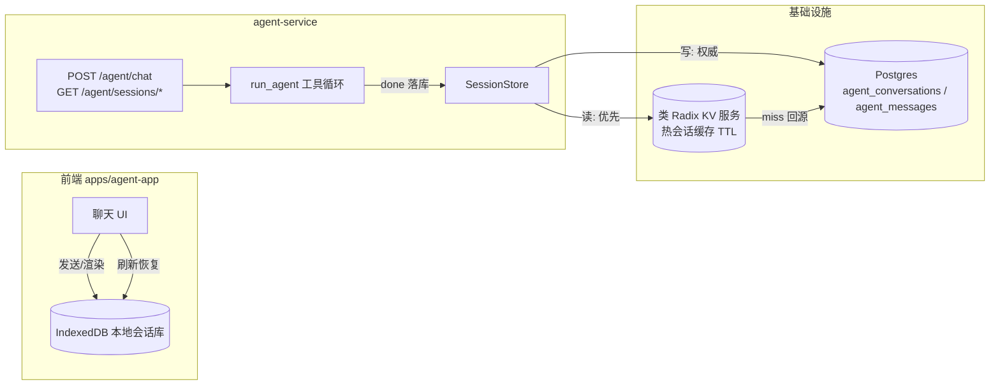

# 会话持久化方案：IndexedDB + 类 Radix KV + Postgres

> 配套文档：`docs/agent-plan.md`（§4 事件协议 / §10.4 会话持久化 / §11.1 run_agent 契约）。
> 本方案把 agent-service 当前的 **session_id 纯透传**（P1 占位）升级为**成熟会话体系**：
> 前端 IndexedDB 本地缓存 + 类 Radix KV 热会话缓存 + Postgres 持久存储，session_id 由**服务端生成/校验**。
> 状态：**方案定稿，待排期实现**（2026-08-19）。

## 1. 现状与问题

| 现状 | 问题 |
| --- | --- |
| `ChatRequest.session_id` 可空透传（`models.py:24`） | 多轮无法可靠关联，同一用户刷新即丢上下文 |
| `done.messages` 只在响应里带出，**不落库** | 历史不可恢复；P3 持久化无载体 |
| 无会话归属（绑定用户） | 无法鉴权「只能读自己的会话」 |
| 无历史查询接口 | 前端无法恢复/列出历史会话 |
| 无本地缓存 | 每次打开都要等后端回放 |

目标：**「本地秒开 + 热会话低延迟 + 全量可恢复 + 归属隔离」**的会话闭环。

## 2. 总体架构（四层配合）



**分工**：

| 层 | 职责 | 读写模型 |
| --- | --- | --- |
| **IndexedDB（前端）** | 会话/消息的**本地镜像**：即时渲染、刷新恢复、离线可用 | 本地主读写；服务端为权威，冲突以服务端为准 |
| **类 Radix KV（热层）** | 近期会话状态 + 最近 N 条消息，TTL 内低延迟读取 | 读优先、miss 回源 PG；写随 PG 刷新 |
| **Postgres（权威层）** | `agent_conversations` / `agent_messages` 全量持久 | 写入的唯一权威源，可重建 KV/前端 |
| **agent-service（编排）** | session_id 生成/校验、归属绑定、事件流 → 存储 | 对外 API + 内部 SessionStore 抽象 |

## 3. session_id 契约（服务端生成/校验）

- **生成**：`POST /api/v1/agent/chat` 未带 `session_id` → 服务端生成（`uuid4`），建会话，随 `done` 返回。
- **续接**：携带 `session_id` → 校验存在 + **归属匹配**（`X-User-Context.uid`），失败返回 `error`（`session_not_found` / `forbidden`）。
- **透传原则废弃**：`agent.py` 的 `_done_event` 不再 `session_id or ""`，改为走 SessionStore 返回权威 id。
- 与现有契约兼容：请求体字段名不变（`session_id?`），前端可先不带，拿到 done 里的 id 后本地缓存复用。

## 4. 数据模型

### 4.1 Postgres（权威，psycopg3 + 懒建表，与其他服务一致）

```sql
CREATE TABLE IF NOT EXISTS agent_conversations (
    id             UUID PRIMARY KEY,
    owner          TEXT        NOT NULL,             -- X-User-Context.uid（归属，防越权）
    title          TEXT        NOT NULL DEFAULT '',  -- 取首条 user 消息前 30 字
    created_at     TIMESTAMPTZ NOT NULL DEFAULT now(),
    updated_at     TIMESTAMPTZ NOT NULL DEFAULT now(),
    last_msg_seq   BIGINT      NOT NULL DEFAULT 0
);

CREATE TABLE IF NOT EXISTS agent_messages (
    conversation_id UUID        NOT NULL REFERENCES agent_conversations(id) ON DELETE CASCADE,
    seq             BIGINT      NOT NULL,            -- 会话内单调序号（分页/摘要用）
    role            TEXT        NOT NULL,            -- system|user|assistant|tool
    content         TEXT        NOT NULL DEFAULT '',
    tool_calls      JSONB       NOT NULL DEFAULT '[]',
    tool_call_id    TEXT,
    created_at      TIMESTAMPTZ NOT NULL DEFAULT now(),
    PRIMARY KEY (conversation_id, seq)
);
CREATE INDEX IF NOT EXISTS idx_agent_messages_conv ON agent_messages (conversation_id, seq);
```

- 表归属 `kg` 库（`postgresql://kg:kg@kg-dev-postgres:5432/kg`），与 auth_users / import_tasks / rules 同库。
- `system` 提示词**不落库**（运行期由 `SYSTEM_PROMPT` 常量注入），落库的是 user / assistant / tool。

### 4.2 类 Radix KV（热会话缓存）

| key | value | TTL |
| --- | --- | --- |
| `agent:sess:{id}:meta` | `{owner, title, updated_at}` | 7d |
| `agent:sess:{id}:msgs` | 最近 N 条（默认 50）`[{seq,role,content,tool_calls,...}]` | 7d |
| `agent:sess:{id}:lock` | 写锁（可选，防并发双写） | 30s |

- 读路径：`GET messages` → KV hit 直接返回；miss → Postgres 分页回源 → 回填 KV。
- 写路径：每轮 `done` → 先写 PG（权威），再刷新 KV 窗口。
- **KV 仅缓存，可整体丢弃**；重启/清空不影响正确性。

## 5. 接口契约

| 方法 | 路径 | 说明 | 状态 |
| --- | --- | --- | --- |
| POST | `/api/v1/agent/chat` | 请求 `{session_id?, message, context?}`；`done` 返回服务端 `session_id` | ✅ 2026-08-19（P2-A 接入） |
| GET | `/api/v1/agent/sessions` | 当前用户会话列表（分页，最新优先） | ✅ 2026-08-19（P2-A） |
| GET | `/api/v1/agent/sessions/{id}/messages` | 历史恢复（`?before_seq=&limit=` 分页；`tool_calls` JSON 原样返回） | ✅ 2026-08-19（P2-A） |
| DELETE | `/api/v1/agent/sessions/{id}` | 删除会话（软删/级联） | ✅ 2026-08-19（P2-A） |

`done` 事件扩展：

```json
{
  "event": "done",
  "data": {
    "session_id": "3f2c…uuid",
    "messages": [ { "role": "assistant", "content": "…", "tool_calls": [] } ]
  }
}
```

- `messages` 语义不变（完整历史），但**现在同时落库**；前端仍忽略渲染、仅 IndexedDB 本地镜像用。

## 6. 前端 IndexedDB（apps/agent-app）

- 新建 `apps/agent-app`（Single-SPA 微应用，见 `docs/agent-plan.md` §5），SSE 客户端仿 `graph-app` `streamRequest`。
- 本地库（原生 IndexedDB 封装，暂不引 Dexie 以减少依赖）：

```
db.agent_db
 ├─ conversations  (key: id)  {id, owner, title, updatedAt, lastSeq}
 └─ messages       (key: [conversationId, seq])  {conversationId, seq, role, content, toolCalls, ts}
```

- **写**：SSE 过程中增量写本地（`delta` 拼完一条 assistant 消息后落一条；`tool` 事件落 tool 消息）；`done` 后写 `conversations`。
- **读/恢复**：打开会话 → 先 IndexedDB 秒开 → 后台 `GET /sessions/{id}/messages` 比对 `lastSeq` 增量拉齐（服务端为权威）。
- **多端一致性**：本地为镜像，服务端为准；本地缺失/seq 落后 → 服务端补齐；不主动回写冲突。

## 7. 存储实现（agent-service，与其他服务同风格）

- 新建 `app/session_store.py`：`PostgresSessionStore`（psycopg3 + 懒建表 + 线性退避重连，仿 `auth-service/app/store.py`）+ `RadixCachedSessionStore`（P2-B：装饰 PG 实现，KV 优先读、随写刷新）。**无 memory 后备**——前端 IndexedDB 承担本地会话缓存（2026-08-19 决策）。
- 配置：`SESSION_STORE=postgres|radix`；`PG_DSN`、`RADIX_URL`（类 Radix 服务地址）。
- `chat.py`：`run_agent` 结束拿到 `done.messages` → `store.append_turn(session_id, owner, messages)`。
- 依赖：`requirements.txt` 增 `psycopg[binary]`。

## 8. 类 Radix KV 服务（本次新增基础设施，决策点）

- **定位**：轻量、Redis 兼容、单机可跑的 KV 缓存（Radix 类）。**只做热会话缓存，不做消息队列**——与仓库「不引入 Celery/RabbitMQ broker」原则不冲突（KV ≠ broker）。
- **形态**：容器服务（`infra/docker-compose.dev.yml` / `docker-compose.yml` 新增 `radix` 服务 + 数据卷），agent-service 经 `RADIX_URL` 访问。
- **为什么需要**：会话热数据跨 agent-service 多实例共享 + TTL 自动过期；Postgres 只做权威层，避免每轮对话全量读 PG。
- **可替换**：若后续倾向托管 Redis，接口层不变（同一 `RadixCachedSessionStore` 换 client 即可）。

## 9. 一致性 / 性能策略

- **写**：每轮 `done` 同步写 PG（权威）→ 异步刷新 KV 窗口（可批量/合并）。
- **读**：KV 优先（≈µs）→ miss 回源 PG 分页（≤ 50 条/页）→ 回填 KV。
- **摘要压缩（P3）**：长会话 PG 存全量；KV 只存最近窗口；`GET messages` 支持 `before_seq` 往前翻页。
- **并发**：同 session 并发写以 `seq` 幂等（`ON CONFLICT DO NOTHING` + 续写），避免重复。

## 10. 安全

- **归属绑定**：所有会话操作以 `X-User-Context.uid` 为准（`chat.py` 已从网关注入覆写 `subject`），读/删会话校验 owner，越权返回 403。
- **会话隔离**：KV/PG 查询一律带 owner 条件，索引 `(owner, updated_at)`。
- **无身份场景**（dev 直连）：owner 为空串，会话仅同环境可用（P1 现状，生产必走网关）。

## 11. 实施阶段（对齐 agent-plan §6）

| 阶段 | 内容 | 交付 |
| --- | --- | --- |
| **P2-A** 后端持久化 | `SessionStore`(memory\|postgres) + session_id 服务端生成/校验 + chat 落库 + `GET sessions`/`GET messages` + 单测（memory）/集成（postgres） | 后端闭环可恢复历史 |
| **P2-B** KV 热层 | infra 加类 Radix 容器 + `RadixCachedSessionStore` + 回源/回填 + TTL | 热会话低延迟 |
| **P3-C** 前端 | 新建 `apps/agent-app` + IndexedDB 本地库 + SSE 客户端 + 会话列表/恢复 UI + 增量拉齐 | 端到端会话闭环 |

## 12. 测试

- **单元**（postgres store，Docker Postgres）：生成/续接/校验、归属越权、分页、`ON CONFLICT` 幂等。
- **集成**（postgres store，Docker）：`agent_conversations/messages` 建表 + 读写 + 回源；KV miss→PG→回填。
- **契约**：`POST /chat` 不带 id → done 返回新 id；带 id → 续接同会话；错 id → error。
- **前端**：IndexedDB 写读、增量拉齐、刷新恢复（vitest + fake-indexeddb）。

## 13. 风险与决策

| 决策/风险 | 结论 |
| --- | --- |
| 引入类 Radix KV 违背「不引 broker」？ | 不违背——KV 是缓存不是队列；如仍顾虑，P2-B 可延后，P2-A 纯 PG 已闭环 |
| IndexedDB 与服务端双写冲突？ | 服务端为权威，本地只做镜像 + seq 增量拉齐，不主动回写 |
| `system` 提示词落库？ | 不落，运行期常量注入，落库仅 user/assistant/tool |
| psycopg 依赖体积 | 后端仅 postgres 权威层（IndexedDB 承担本地缓存），psycopg 为必要依赖 |
