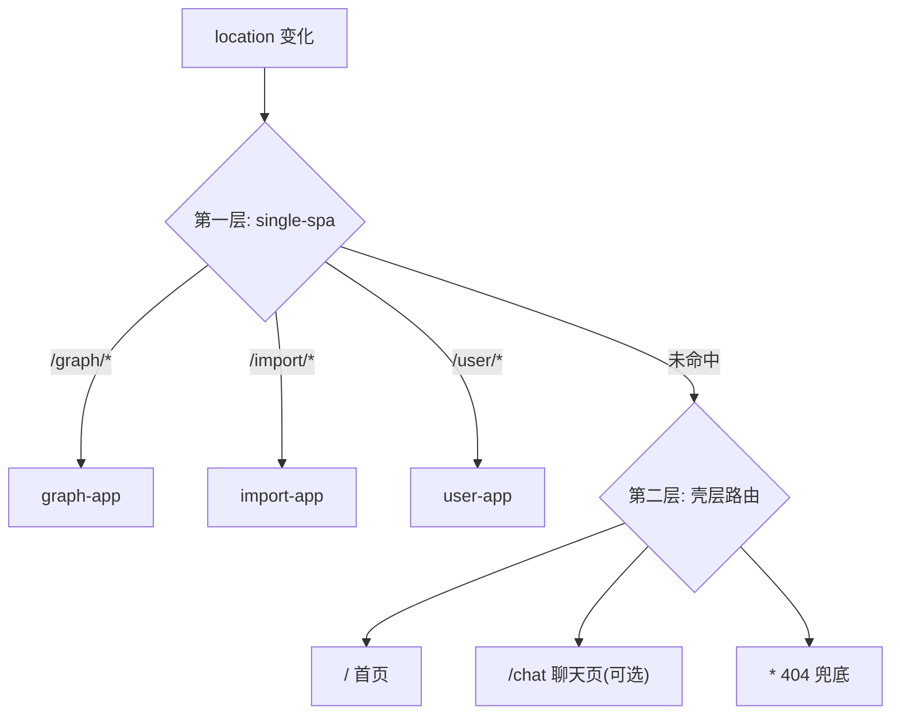

# Shell 基础路由 + 组件体系规划

> 目标：为 `apps/shell`（Single-SPA root-config）补齐两层能力——
> **壳层页面路由**（首页 / 404 / 登录态跳转）与**组件体系**（UI 基座 + 分层复用）。
> 原则延续架构基调：轻量、无框架依赖、原生 importmap、模块走 API 隔离。
>
> 决策（已定稿）：壳层路由用**轻量自研 router**（纯 History API，不引入路由库）；
> 组件用**原生 Web Components + 自研基类**（不引入 Lit）。

## 1. 现状与问题

`apps/shell` 已有隐式路由与组件雏形，但散落在 `main.ts`，未收口成体系：

| 维度          | 现状                                                                                | 问题                                             |
| ------------- | ----------------------------------------------------------------------------------- | ------------------------------------------------ |
| 子应用路由    | `registerApplication` ×3：`/graph`、`/import`、`/user`，`activeWhen: startsWith`    | 正常，**保持不变**（微前端边界）                 |
| 壳层跳转/高亮 | `navigateToUrl` + `data-route` + 监听 `single-spa:app-change`（`refreshActive`）    | 逻辑内联在 `main.ts`，加菜单即改多处             |
| 导航显隐      | 硬编码 `HIDE_NAV_PREFIXES = ["/graph"]`（`applyNavVisibility`）                     | 应进路由元数据                                   |
| 壳层页面      | 首页 `/` 是**空页面**；无 404；登录后 `navigateToUrl("/")` 落到空白                 | 需壳层页面路由                                   |
| 组件          | `login-view`、`chat-component` 两个原生 Web Components，各自 `template`+shadow 样板 | 无 UI 基础层、`chat` 裸挂 `document.body` 非抽屉 |

## 2. 总体分层



- **第一层（子应用路由）**：single-spa 已承担，不动。壳层路由只匹配「子应用前缀之外」的路径。
- **第二层（壳层页面路由）**：本次新增，轻量自研 router。

## 3. 路由规划

### 3.1 新增文件（`src/router/`）

```
src/router/
  routes.ts          # 路由表 + 路由元数据
  router.ts          # 核心：History API + 监听（~80 行）
  view-container.ts  # <view-container> 壳层视图挂载容器
```

### 3.2 路由表（`routes.ts`）

```ts
export interface ShellView {
  /** 返回要挂载的自定义元素标签，如 "home-view" */
  tag: string
}

export interface ShellRoute {
  path: string // "/" | "/chat"；"*" 兜底 404
  view: () => ShellView
  hideNav?: boolean // 取代 HIDE_NAV_PREFIXES
  requiresAuth?: boolean // 未登录访问 → 重定向登录/首页
}

export const shellRoutes: ShellRoute[] = [
  { path: "/", view: () => ({ tag: "home-view" }) },
  // { path: "/chat", view: () => ({ tag: "chat-view" }) },  // P3 可选
  { path: "*", view: () => ({ tag: "not-found-view" }) },
]

/** 子应用前缀交给 single-spa，壳层只处理未命中的路径 */
export function matchShellRoute(pathname: string): ShellRoute {
  return (
    shellRoutes.find((r) => r.path !== "*" && pathname.startsWith(r.path)) ??
    shellRoutes[shellRoutes.length - 1]
  )
}
```

### 3.3 核心 router（`router.ts`）

```ts
export const router = {
  navigate(to: string): void   // pushState + 广播
  get current(): ShellRoute
  listen(cb: () => void): () => void
  init(): void                 // 监听 popstate + single-spa:app-change
}
```

- 跳转用 `history.pushState` + 派发自定义事件（如 `shell:route-change`），不依赖任何路由库；
- 同时监听 `popstate` 与 `single-spa:app-change`——子应用挂载/卸载也会改变当前路径，导航高亮需同步刷新；
- 当前路径命中子应用前缀时，壳层路由返回「无壳层视图」（`null`），`view-container` 保持空。

### 3.4 收口 `main.ts` 散逻辑

现有以下逻辑全部迁入 router / 组件，`main.ts` 只保留「装配」职责：

| 现有散逻辑                                   | 去向                                 |
| -------------------------------------------- | ------------------------------------ |
| `refreshActive()`（导航高亮）                | `nav-link` 组件 + router 广播        |
| `applyNavVisibility()` + `HIDE_NAV_PREFIXES` | 路由元数据 `hideNav`                 |
| 登录后 `navigateToUrl("/")`                  | `router.navigate("/")`               |
| `startSpa()` / `hasValidToken` 登录守卫      | router 初始化时的 auth 守卫          |
| 未登录访问受保护路径                         | `requiresAuth` → 统一重定向首页/登录 |

### 3.5 约定

- 壳层页面一律用自定义元素承载（`home-view`、`not-found-view`…），由 `view-container` 负责挂载/卸载，与子应用挂载方式同构；
- 不在壳层引入 react-router / navigo / page.js 等——壳层页面量少，自研 router 成本低、零依赖、与 single-spa 事件天然协同。

## 4. 组件规划

### 4.1 目录分层

```
src/components/
  base/        # BaseComponent 基类
  ui/          # 基础 UI（可复用、无业务）: nav-link / drawer / modal / toast / button / input
  layout/      # 壳层布局: shell-nav / user-chip / login-view(迁入)
  feature/     # 业务组件: chat（抽屉化）
```

### 4.2 基类（`base/BaseComponent.ts`）

收敛 `login.ts` / `chat.ts` 里重复的「`<template>` + shadow + 属性绑定」样板：

```ts
export abstract class BaseComponent extends HTMLElement {
  protected shadow: ShadowRoot
  protected abstract template(): string
  protected styles(): string {
    return ""
  } // 默认透传 tokens.css 变量
  // connectedCallback / disconnectedCallback / 属性观察 由基类统一提供
}
```

设计要点：

- **样式**：一律消费 `styles/tokens.css` 的 CSS 变量，**不再在组件内重复定义色值**（现状 `chat.ts` 里的 `--primary: 59,130,246` 等需删除，改用公共 token）；
- **事件**：业务事件通过 `CustomEvent` 冒泡，组件不直接依赖 `authStore` / `chatService`（依赖由上层注入，保持可复用）。

### 4.3 首批组件清单（按优先级）

| 组件                           | 目录   | 用途                                  | 承接痛点                             |
| ------------------------------ | ------ | ------------------------------------- | ------------------------------------ |
| `nav-link`                     | ui     | 统一导航高亮/显隐，与 router 广播联动 | 替换手写 `refreshActive`             |
| `view-container`               | router | 壳层视图挂载/卸载                     | 路由的挂载点                         |
| `drawer`                       | ui     | 通用抽屉浮层                          | `chat` 抽屉化（agent-plan 既定方向） |
| `modal` / `toast`              | ui     | 确认流 / 提示                         | 承接 agent-plan `confirm` 事件       |
| `button` / `input`             | ui     | 表单基件                              | `login` 表单复用                     |
| `home-view` / `not-found-view` | layout | 首页 / 404 壳层视图                   | 补壳层空页面                         |

## 5. 落地阶段（分步手册）

> 以下每步给出「改哪个文件 / 粘贴什么 / 为什么」。**P0 为完整可运行代码，可直接照抄**；P1~P3 为要点清单。
> 文件路径均为 `apps/shell/` 下的相对路径。

### P0 — 路由骨架（核心，一次跑通）

**Step 0.1 新建 `src/router/routes.ts`** — 壳层路由表 + 子应用前缀声明

```ts
// 子应用前缀：命中即归 single-spa，壳层不渲染任何视图
export const SUBAPP_PREFIXES = ["/graph", "/import", "/user"] as const

export interface ShellRoute {
  path: string
  tag: string // 要挂载的自定义元素标签
  hideNav?: boolean // 命中该路由时隐藏 #shell-nav（取代 HIDE_NAV_PREFIXES）
  requiresAuth?: boolean // 预留：未登录访问 → 重定向首页/登录
}

export const shellRoutes: ShellRoute[] = [
  { path: "/", tag: "home-view" },
  { path: "/chat", tag: "chat-view" }, // P3 可选，暂不建文件
  { path: "*", tag: "not-found-view" },
]

export function matchShellRoute(pathname: string): ShellRoute | null {
  if (SUBAPP_PREFIXES.some((p) => pathname.startsWith(p))) return null
  for (const r of shellRoutes) {
    if (r.path === "*") continue
    if (r.path === "/") {
      if (pathname === "/") return r // 首页必须精确匹配，否则所有路径都高亮首页
    } else if (pathname.startsWith(r.path)) {
      return r
    }
  }
  return shellRoutes.find((r) => r.path === "*") ?? null
}
```

**为什么**：把「哪些是子应用路径 / 哪些是壳层页面 / 元数据」集中成一表，以后加菜单、加页、改显隐只动这一个文件；`SUBAPP_PREFIXES` 保证壳层路由绝不与 single-spa 抢路径。

**Step 0.2 新建 `src/router/router.ts`** — 统一 navigate / 事件广播

```ts
import { matchShellRoute, type ShellRoute } from "./routes"

export const ROUTE_CHANGE_EVENT = "shell:route-change"

function dispatch(): void {
  window.dispatchEvent(new CustomEvent(ROUTE_CHANGE_EVENT))
}

export const router = {
  navigate(to: string): void {
    history.pushState({}, "", to)
    dispatch()
  },

  get current(): ShellRoute | null {
    return matchShellRoute(location.pathname)
  },

  listen(cb: () => void): () => void {
    window.addEventListener(ROUTE_CHANGE_EVENT, cb)
    return () => window.removeEventListener(ROUTE_CHANGE_EVENT, cb)
  },

  init(): void {
    window.addEventListener("popstate", dispatch) // 浏览器前进/后退
    window.addEventListener("single-spa:app-change", dispatch) // 子应用挂/卸也改路径
  },
}
```

**为什么**：导航高亮、显隐、视图挂载都只订阅这一个事件源；同时监听 `popstate` 与 `single-spa:app-change`，子应用切换时壳层 UI 同步刷新——把 `main.ts` 里手写的 listener 正式化收口。

**Step 0.3 新建 `src/components/base/BaseComponent.ts`** — 组件基类（P0 顺带建，供视图使用）

```ts
export abstract class BaseComponent extends HTMLElement {
  protected shadow: ShadowRoot

  constructor() {
    super()
    this.shadow = this.attachShadow({ mode: "open" })
  }

  protected abstract template(): string

  /** 组件内样式（默认空 → 全用全局 tokens.css，视觉单一来源） */
  protected styles(): string {
    return ""
  }

  connectedCallback(): void {
    this.shadow.innerHTML = `<style>${this.styles()}</style>${this.template()}`
    this.onMount()
  }

  protected onMount(): void {}
}
```

**为什么**：`login.ts`/`chat.ts` 现在各写一遍 `template`+shadow 样板；基类收敛后新组件只写 `template()`，样式默认归零 → 强制走 tokens（不再重复定义色值）。

**Step 0.4 新建 `src/router/view-container.ts`** — 壳层视图挂载点

```ts
import { matchShellRoute } from "./routes"
import { router } from "./router"

export class ViewContainer extends HTMLElement {
  connectedCallback(): void {
    this.render()
    router.listen(() => this.render())
  }

  private render(): void {
    this.replaceChildren()
    const route = matchShellRoute(location.pathname)
    if (!route) return // 子应用路径 → 保持空容器
    const view = route.view() // routes.ts 的 view 工厂，返回 { tag }
    this.appendChild(document.createElement(view.tag))
  }
}

customElements.define("view-container", ViewContainer)
```

> 注：`route.tag` → `route.view().tag` 是因为 `routes.ts` 采用 `view: () => ShellView` 工厂接口（与 3.2 定义一致）。

**为什么**：壳层页面（首页/404）有统一挂载容器，挂/卸逻辑一处管理；命中子应用前缀时返回空，不干扰 single-spa。

**Step 0.5 新建 `src/components/layout/home-view.ts` 与 `not-found-view.ts`**

```ts
// home-view.ts
import { BaseComponent } from "../base/BaseComponent"

export class HomeView extends BaseComponent {
  template(): string {
    return `
      <style>
        h1 { margin: 0 0 8px; font-size: 20px; }
        p { margin: 0; color: rgb(var(--muted-foreground)); font-size: 14px; }
      </style>
      <h1>知识图谱平台</h1>
      <p>从导航进入「图谱」或「数据导入」模块。</p>
    `
  }
}
customElements.define("home-view", HomeView)
```

```ts
// not-found-view.ts（同目录）
import { BaseComponent } from "../base/BaseComponent"

export class NotFoundView extends BaseComponent {
  template(): string {
    return `
      <style>
        h1 { margin: 0 0 8px; font-size: 20px; }
        a { color: rgb(var(--overlay-bg)); font-size: 14px; }
      </style>
      <h1>404 · 页面不存在</h1>
      <a href="/">返回首页</a>
    `
  }
}
customElements.define("not-found-view", NotFoundView)
```

**为什么**：补上现状两个空白页（首页此前无内容、未知路径无兜底）；样式只消费 tokens，不新增全局变量。

**Step 0.6 修改 `index.html`** — 挂载点 + 样式

在 `<main id="shell-main">` 内、三个子应用容器旁加一行：

```html
<view-container></view-container>
```

并在 `<style>` 里补（与现有子应用容器 `pointer-events` 处理同款）：

```css
view-container {
  position: absolute;
  inset: 0;
  overflow: auto;
  padding: 24px;
  pointer-events: none; /* 空容器不拦截下方子应用点击 */
}
view-container:not(:empty) {
  pointer-events: auto; /* 有壳层视图时可交互 */
}
```

**为什么**：`view-container` 与子应用容器同处 `#shell-main`（绝对定位参照系）；空时 `pointer-events:none` 避免挡住下方子应用交互，非空时恢复——复用现有容器模式。

**Step 0.7 修改 `src/main.ts`** — 收口散逻辑

- 顶部 import 改为：`import { router } from "./router/router"`、`import "./router/view-container"`、`import "./components/layout/home-view"`、`import "./components/layout/not-found-view"`
- 删除 `HIDE_NAV_PREFIXES`、`onRouteChange`，以及底部 `window.addEventListener("single-spa:app-change", onRouteChange)` 与 `onRouteChange()`
- 启动处改为：

```ts
router.init()
router.listen(() => {
  refreshActive()
  applyNavVisibility()
})
```

- `applyNavVisibility` 改为读路由元数据（替代硬编码前缀）：

```ts
function applyNavVisibility(): void {
  const nav = document.getElementById("shell-nav")
  if (!nav) return
  nav.style.display = router.current?.hideNav ? "none" : ""
}
```

- 登录成功回调里 `if (location.pathname !== "/") navigateToUrl("/")` 改为 `router.navigate("/")`

**为什么**：`main.ts` 只留「装配」（注册子应用 + 登录状态机 + `router.init`）；导航高亮/显隐/跳转全走单一事件源，以后加菜单、加页面不再改 `main.ts`。

### P1 — 组件基座迁移

1. `login.ts`：改为继承 `BaseComponent`，把 `TEMPLATE` 拆进 `template()`，样式本身已消费 tokens 的不动；位置可从 `components/login.ts` 迁到 `components/layout/login-view.ts`（可选，避免大 diff 可先不动）。
2. `chat.ts`：删除 shadow 里重复定义的 `--primary/--surface/--background/...` 一组变量，改直接 `rgb(var(--primary))` 等。
   **注意**：chat 现用色值（偏蓝黑，如 `--background: 15,23,42`）与 tokens 深色（`30,33,38`）略不同，删除后观感会随 tokens 统一——这正是目的；若想保留 chat 专属观感，改为在 `:host` 上覆盖少量 token 并注释说明。
3. 之后抽 `nav-link` 组件：订阅 `shell:route-change` 统一高亮，`index.html` 里 `a[data-route]` 换成 `<nav-link route="/graph">`，`refreshActive` 删除。

### P2 — 抽屉化 chat

1. 新增 `src/components/ui/drawer.ts`：通用抽屉（`open/close` + 遮罩 + ESC 关闭）。
2. `chat-component` 改为「入口按钮 + drawer 承载」，移除 `document.body.appendChild` 裸挂。
3. `index.html`/`main.ts` 挂全局入口按钮（登录后显示）。

### P3 — 支撑 agent（可选，不贴码）

1. `ui/modal.ts` + `ui/toast.ts`，承接 agent-plan 的 `confirm` 事件确认流与结果提示。
2. 可选壳层 `/chat` 全屏页：路由表加一行 + 建 `chat-view`。

## 6. 验收清单（P0）

- [ ] 访问 `/` → 显示 home-view，导航「首页」高亮
- [ ] 访问 `/graph`、`/import`、`/user` → 子应用正常挂载，`view-container` 为空且不挡点击
- [ ] 访问任意未知路径（如 `/xyz`）→ 显示 404
- [ ] 登录/退出 → 跳转与导航高亮同步刷新；图谱页仍隐藏导航（`hideNav` 元数据生效）
- [ ] 浏览器前进/后退 → 高亮与视图正确

## 7. 不做的事（明确边界）

- 不改 single-spa 子应用注册与 activeWhen（微前端边界保持不动）；
- 不引入前端框架 / 路由库 / Lit（延续零依赖基调，除非后续组件量级大到自研基类维护成本超过收益再评估）；
- 不在 shell 内复制子应用业务逻辑（首页等壳层视图只做聚合入口与状态展示）。
